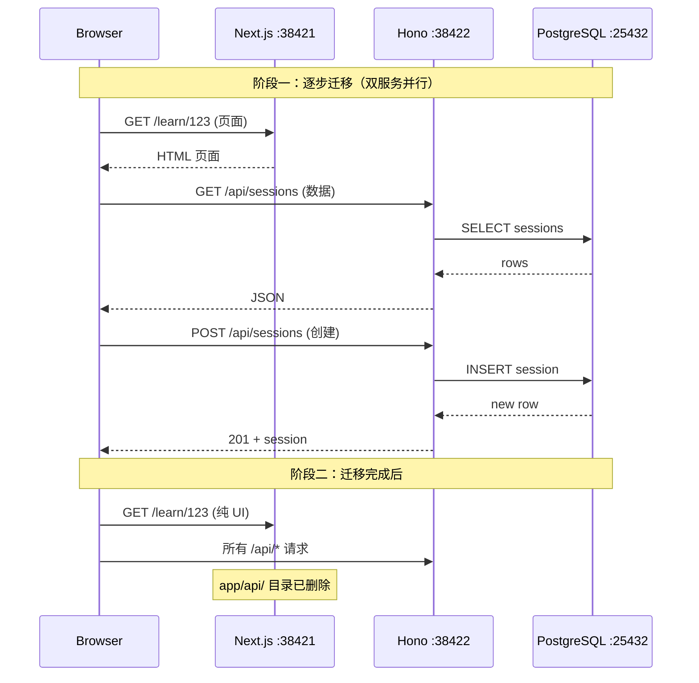
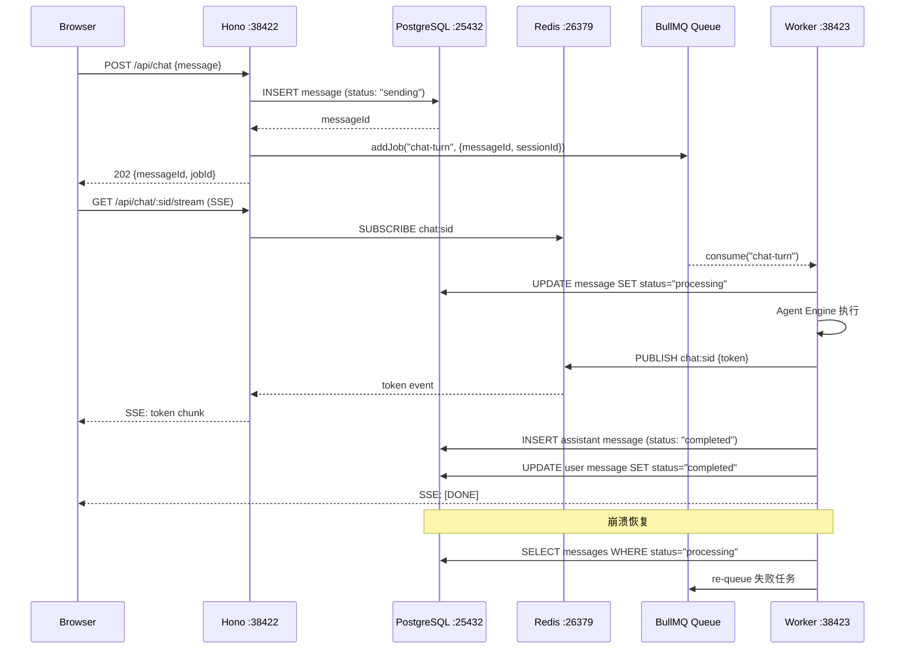
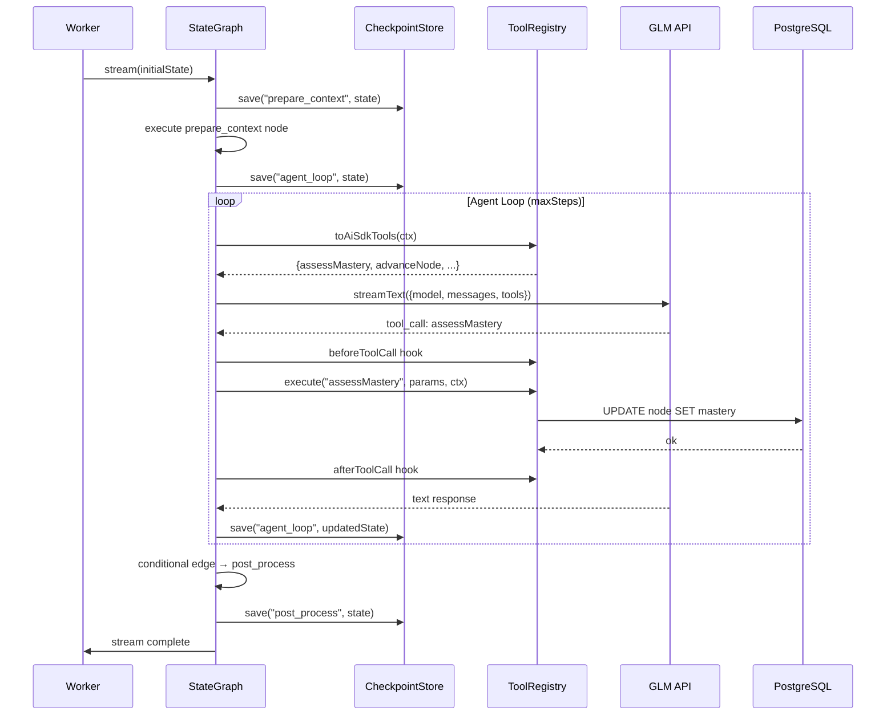
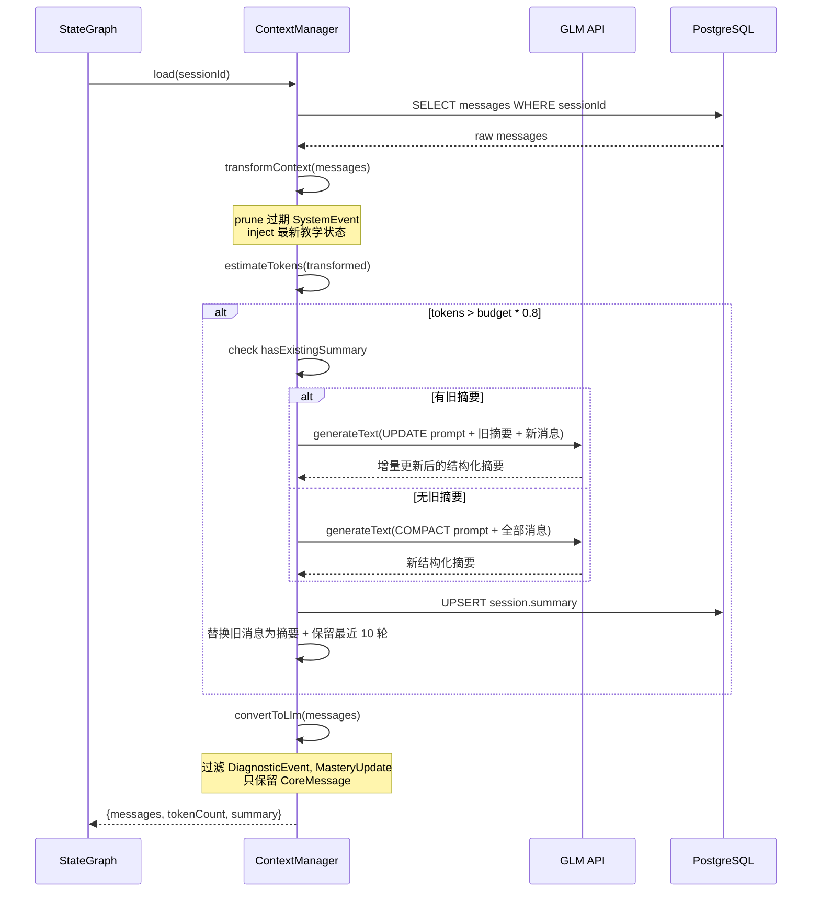
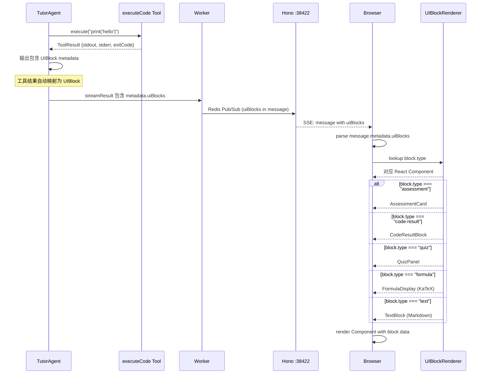
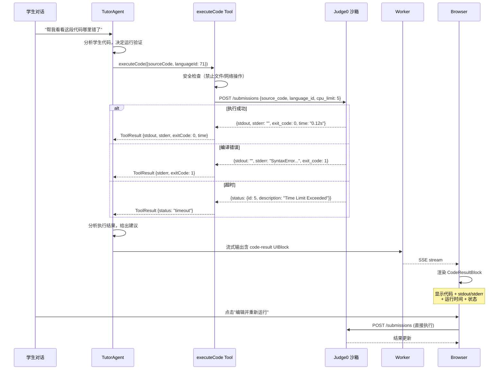
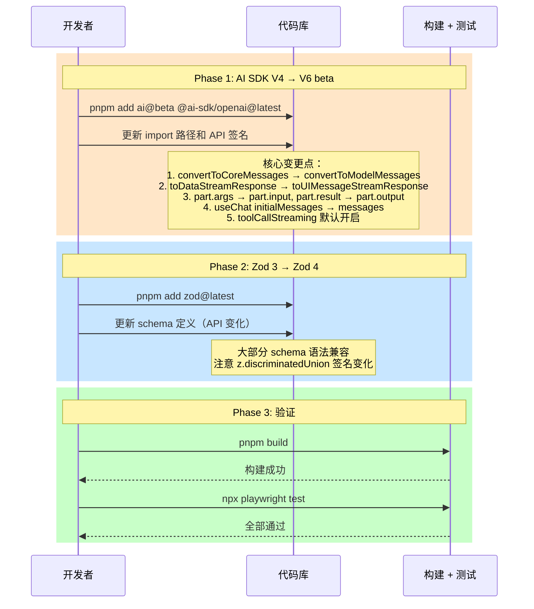

# AI Teacher — 开发迭代计划

> 版本：v0.7
> 更新日期：2026-05-09
> 状态：已对齐实际进展 + 新增架构升级迭代 016-023

---

## 迭代总览

### 分类说明

| 标签 | 含义 | 颜色 |
|------|------|------|
| `功能` | 面向用户的新功能 | 🔵 |
| `优化` | 架构/性能/质量的内部优化 | 🟠 |
| `基础设施` | 项目骨架和环境搭建 | ⚪ |

### 全部迭代

| 编号 | 名称 | 分类 | 优先级 | 依赖 | 状态 | 完成日期 |
|------|------|------|--------|------|------|----------|
| 001 | 项目骨架 + Docker 环境 | 基础设施 | P0 | - | ✅ 已完成 | 2026-05-08 |
| 002 | 数据模型 + Prisma Schema | 基础设施 | P0 | 001 | ✅ 已完成 | 2026-05-08 |
| 003 | 苏格拉底追问 Agent 核心 | 功能 | P0 | 002 | ✅ 已完成 | 2026-05-08 |
| 004 | Chat UI + 三栏布局 | 功能 | P0 | 002 | ✅ 已完成 | 2026-05-08 |
| 005 | 知识图谱生成 + 可视化 | 功能 | P0 | 003 | ✅ 已完成 | 2026-05-08 |
| 006 | 诊断摸底 | 功能 | P0 | 003 | ✅ 已完成 | 2026-05-08 |
| 007 | 掌握度评分 + 门控 | 功能 | P0 | 003 | ✅ 已完成 | 2026-05-08 |
| 008 | 评估卡片渲染 | 功能 | P0 | 007 | ✅ 已完成 | 2026-05-08 |
| 009 | 学习资料上传 + RAG | 功能 | P0 | 002 | ⬜ 待开始 | — |
| 010 | 会话管理 + 历史记录 | 功能 | P0 | 004 | ✅ 已完成 | 2026-05-08 |
| **011** | **Agent 引擎重构 Phase 1** | **优化** | **P0** | **003** | ✅ **已完成** | 2026-05-08 |
| **012** | **Agent 引擎重构 Phase 2** | **优化** | **P1** | **011** | ✅ **已完成** | 2026-05-08 |
| 013 | 学习者画像 + 跨会话记忆 | 功能 | P1 | 007, 012 | ✅ 已完成 | 2026-05-08 |
| 014 | 快问 + AI 建议回复 | 功能 | P1 | 004, 011 | ✅ 已完成 | 2026-05-08 |
| 015 | 首页重设计 + 护眼配色 | 优化 | P1 | 004, 010 | ✅ 已完成 | 2026-05-09 |
| 016 | 架构拆分 Phase 1：Next.js → Hono API 迁移 | 优化 | P0 | 015 | ⬜ 待开始 | — |
| 017 | 架构拆分 Phase 2：Worker 激活 + BullMQ 队列 | 优化 | P0 | 016 | ⬜ 待开始 | — |
| 018 | Agent 引擎重构 Phase 3：StateGraph + Tool Registry | 优化 | P0 | 017 | ⬜ 待开始 | — |
| 019 | 上下文管理升级：Compaction + AgentMessage 分层 | 优化 | P1 | 018 | ⬜ 待开始 | — |
| 020 | A2UI 框架 + 代码编辑器 | 功能 | P1 | 018 | ⬜ 待开始 | — |
| 021 | 代码执行沙箱 | 功能 | P1 | 020 | ⬜ 待开始 | — |
| 022 | 多 Agent 协作 + Subagent | 优化 | P2 | 018 | ⬜ 待开始 | — |
| 023 | 技术栈全面升级 | 优化 | P2 | 017 | ⬜ 待开始 | — |

---

## 关键路径

```
001 项目骨架
  └── 002 数据模型
        ├── 003 苏格拉底 Agent ← 核心
        │     ├── 005 知识图谱
        │     ├── 006 诊断摸底
        │     ├── 007 掌握度评分
        │     │     └── 008 评估卡片
        │     ├── 011 Agent 引擎 Phase 1 ← 优化
        │     │     └── 012 Agent 引擎 Phase 2
        │     └── 013 学习者画像
        ├── 004 Chat UI
        │     ├── 010 会话管理
        │     │     └── 015 首页重设计
        │     │           └── 016 架构拆分 Phase 1 ← 新
        │     │                 ├── 017 Worker + BullMQ
        │     │                 │     ├── 018 StateGraph + Tool Registry
        │     │                 │     │     ├── 019 上下文管理升级
        │     │                 │     │     ├── 020 A2UI + 代码编辑器
        │     │                 │     │     │     └── 021 代码执行沙箱
        │     │                 │     │     └── 022 多 Agent 协作
        │     │                 │     └── 023 技术栈升级
        │     └── 014 快问
        └── 009 资料上传 + RAG
```

**最短 MVP 路径**：001 → 002 → 003 → 004 → 005 → 007 → 010 → 011

---

## 已完成迭代详情

### 001 项目骨架 + Docker 环境 ✅

- [x] pnpm workspaces 配置（apps/web, apps/worker, packages/*）
- [x] Next.js 15 + TypeScript 项目初始化
- [x] Worker 项目初始化（tsx watch）
- [x] Docker Compose 配置（PostgreSQL 16 + pgvector, Redis 7, MinIO）
- [x] Prisma 初始化 + 基础配置
- [x] ESLint + Prettier + TypeScript strict
- [x] `.env.example` + 环境变量管理
- [x] 验证：`docker compose up -d` 所有服务正常启动

### 002 数据模型 + Prisma Schema ✅

- [x] Prisma Schema 定义（User, Source, Session, Roadmap, Node, Message, LearnerProfile）
- [x] pgvector 扩展（资料向量存储预留）
- [x] 迁移脚本
- [x] 种子数据脚本（test user + React Hooks 主题 + 5 节点 roadmap + 示例消息）

### 003 苏格拉底追问 Agent 核心 ✅

- [x] Tutor Agent system prompt 设计
- [x] Agent Loop 实现（AI SDK streamText + tool calling）
- [x] 掌握度评估工具（assessMastery）
- [x] 知识点追踪工具（recordStrength / recordMisconception）
- [x] 评估卡片工具（generateAssessment）
- [x] 节点推进工具（advanceNode）
- [x] 上下文管理（当前节点 + allNodes + 已掌握节点 + 学习者画像）
- [x] 流式响应（SSE）

### 004 Chat UI + 三栏布局 ✅

- [x] 三栏布局（左侧栏 + 对话区 + 右侧路线图）
- [x] 对话气泡组件（支持文本、代码块）
- [x] 输入框 + 发送
- [x] SSE 流式接收 + 打字机效果
- [x] shadcn/ui 初始化 + 7 个基础组件
- [x] 暖色教育主题设计系统

### 005 知识图谱生成 + 可视化 ✅

- [x] Roadmap Agent（根据主题生成节点序列，Zod Schema 约束）
- [x] LLM 失败时 fallback 到通用 5 节点模板
- [x] 前端节点列表/路径可视化（垂直 timeline）
- [x] 节点状态标识（✓ 已掌握 / ● 进行中 / ○ 未开始）
- [x] 进度条 + 百分比

### 006 诊断摸底 ✅

- [x] 诊断问题生成（Diagnostic Agent + Zod Schema）
- [x] 答案评估 + 水平定位
- [x] 起始节点定位 + 自动跳过已掌握节点
- [x] 前端诊断 UI（DiagnosticQuiz 组件：选择题 + 简答题 + 进度条）

### 007 掌握度评分 + 门控 ✅

- [x] Tutor prompt 包含完整节点列表（含 ID），LLM 可正确调用 assessMastery
- [x] 80% 门控逻辑（masteryScore ≥ 80 时自动推进下一节点）
- [x] 后端自动推进：掌握后查找下一个 not-started 节点
- [x] 前端 onFinish 回调：对话流结束后刷新节点状态

### 008 评估卡片渲染 ✅

- [x] 评估卡片结构化数据（总结 + 回顾表格 + 核心标签）
- [x] 前端卡片组件
- [x] "下一节"按钮
- [x] 验证：节点掌握后显示评估卡片

### 010 会话管理 + 历史记录 ✅

- [x] 左侧栏会话列表（学习中 / 已完成）
- [x] 新建会话
- [x] 会话恢复（断点续学）
- [x] 会话删除/归档
- [x] 首页改造为会话仪表盘（不再自动跳转）
- [x] 验证：关闭浏览器 → 重新打开 → 继续上次学习

---

## 待实现迭代详情

### 009 学习资料上传 + RAG 🔵功能

**目标**：用户上传资料，Agent 基于资料教学

- [ ] PDF 解析（pdf-parse）
- [ ] Markdown 解析
- [ ] 文档分块（Chunk）
- [ ] 向量化 + 存储到 PostgreSQL (pgvector)
- [ ] 相似度检索
- [ ] 上传 UI
- [ ] MinIO 文件存储
- [ ] 验证：上传 PDF → 系统解析 → 基于资料内容教学

### 011 Agent 引擎重构 Phase 1 🟠优化 ✅

**目标**：建立 Agent 框架基础设施，工具副作用内化

**方案文档**：[Agent引擎优化方案](../设计/Agent引擎优化方案.md)

- [x] 创建 `BaseAgent` 抽象基类（provider 统一 + 生命周期钩子）
- [x] 统一 Provider 创建（去掉 3 处重复）
- [x] 工具副作用内化（execute 做真实操作）
- [x] 创建 `NodeService` 封装节点操作
- [x] 创建 `MessageService` 封装消息持久化
- [x] 瘦身 `chat/route.ts`（移除 persistChatTurn）
- [x] RoadmapAgent / DiagnosticAgent 继承 BaseAgent
- [x] 验证：20/20 E2E 测试通过

### 012 Agent 引擎重构 Phase 2 🟠优化 ✅

**目标**：上下文管理 + 错误恢复

**方案文档**：[Agent引擎优化方案](../设计/Agent引擎优化方案.md)

- [x] `MessageTransformer` 消息截断策略
- [x] Token 预算估算（估算后再决定是否截断）
- [x] 历史消息摘要（超过阈值时摘要中间轮次）
- [x] LLM 调用重试（指数退避，最多 3 次）
- [x] Fallback 模型（主模型 → fallback 模型链）
- [x] 流式响应超时检测（120s Promise.race）
- [x] 验证：20/20 E2E 测试通过

### 013 学习者画像 + 跨会话记忆 🔵功能

**目标**：跨会话记住用户信息

- [x] 学习者画像数据结构（学习偏好、擅长领域、误解模式）
- [x] 每次会话结束后更新画像
- [x] 新会话注入画像到 Agent prompt
- [x] 验证：构建通过 + 20/20 E2E 测试通过

### 014 快问 + AI 建议回复 🔵功能 ✅

**目标**：辅助功能

- [x] 快问：选中内容 → 提取上下文 → 调用 LLM
- [x] AI 建议回复：用户不知道怎么答时提供提示
- [x] 验证：22/22 E2E 测试通过（含快问 + 建议回复 API 测试）

### 015 首页重设计 + 护眼配色 🟠优化 ✅

**目标**：首页视觉升级

---

## 架构升级迭代详情

> 以下 8 个迭代（016-023）基于 [架构升级方案](../设计/架构升级方案.md) 设计，实现三层分离（Next.js 纯 UI + Hono API + Worker 计算引擎）。
>
> **端口约定**：Web :38421 | Hono :38422 | Worker :38423 | PG :25432 | Redis :26379

---

### 016 架构拆分 Phase 1：Next.js → Hono API 迁移 🟠优化

**目标**：将 API Routes 从 Next.js 迁移到 Hono，Next.js 变为纯前端

**优先级**：P0 | **依赖**：015

#### 时序图



#### 伪代码

```typescript
// apps/server/src/index.ts — Hono 入口
import { Hono } from "hono"
import { serve } from "@hono/node-server"
import { cors } from "hono/cors"
import { logger } from "hono/logger"
import { sessionsRoute } from "./routes/sessions"
import { diagnosticRoute } from "./routes/diagnostic"
import { suggestedTopicsRoute } from "./routes/suggested-topics"
import { suggestReplyRoute } from "./routes/suggest-reply"
import { quickQuestionRoute } from "./routes/quick-question"
import { errorHandler } from "./middleware/error-handler"

export const app = new Hono()

// 全局中间件
app.use("*", cors({ origin: "http://localhost:38421", credentials: true }))
app.use("*", logger())
app.onError(errorHandler)

// 挂载路由
app.route("/api/sessions", sessionsRoute)
app.route("/api/sessions/:sessionId/diagnostic", diagnosticRoute)
app.route("/api/suggested-topics", suggestedTopicsRoute)
app.route("/api/suggest-reply", suggestReplyRoute)
app.route("/api/quick-question", quickQuestionRoute)

// 启动
serve({ fetch: app.fetch, port: 38422 }, (info) => {
  console.log(`Hono API listening on http://localhost:${info.port}`)
})

// apps/server/src/routes/sessions.ts — 路由示例
import { Hono } from "hono"
import { zValidator } from "@hono/zod-validator"
import { prisma } from "@ai-teacher/db"
import { createSessionSchema } from "@ai-teacher/shared"

export const sessionsRoute = new Hono()
  .get("/", async (c) => {
    const userId = c.req.header("x-user-id") // 临时，后续走 auth middleware
    const sessions = await prisma.session.findMany({
      where: { userId }, orderBy: { updatedAt: "desc" },
    })
    return c.json(sessions)
  })
  .post("/", zValidator("json", createSessionSchema), async (c) => {
    const data = c.req.valid("json")
    const session = await prisma.session.create({ data })
    return c.json(session, 201)
  })
```

#### 文件清单

| 操作 | 文件路径 | 说明 |
|------|---------|------|
| 新增 | `apps/server/package.json` | Hono 项目配置，依赖 hono + @hono/node-server + @hono/zod-validator |
| 新增 | `apps/server/tsconfig.json` | TypeScript 配置，引用 shared/db workspaces |
| 新增 | `apps/server/src/index.ts` | Hono 入口，serve 监听 38422 |
| 新增 | `apps/server/src/config.ts` | 环境变量读取（DATABASE_URL, PORT 等） |
| 新增 | `apps/server/src/routes/sessions.ts` | 会话 CRUD 路由 |
| 新增 | `apps/server/src/routes/diagnostic.ts` | 诊断路由（生成 + 评估） |
| 新增 | `apps/server/src/routes/suggested-topics.ts` | 推荐话题路由 |
| 新增 | `apps/server/src/routes/suggest-reply.ts` | AI 建议回复路由（SSE） |
| 新增 | `apps/server/src/routes/quick-question.ts` | 快问路由（SSE） |
| 新增 | `apps/server/src/middleware/error-handler.ts` | 全局错误处理 |
| 新增 | `apps/server/src/middleware/auth.ts` | 认证中间件（预留） |
| 修改 | `apps/web/src/lib/api-client.ts` | API base URL 改为 `http://localhost:38422` |
| 修改 | `pnpm-workspace.yaml` | 新增 `apps/server` |
| 修改 | `package.json` | 新增 `dev:server` 脚本，更新 `dev` 为 run-p |
| 删除 | `apps/web/src/app/api/**/*.ts` | Next.js API Routes 全部删除 |

#### Checklist

- [ ] 创建 `apps/server/` 目录，初始化 Hono 项目（hono + @hono/node-server）
- [ ] 迁移 `/api/sessions` 路由（POST 创建 + GET 列表）
- [ ] 迁移 `/api/sessions/[id]` 路由（GET + PATCH + DELETE）
- [ ] 迁移 `/api/sessions/[id]/diagnostic` 路由（POST 生成 + POST 评估）
- [ ] 迁移 `/api/suggested-topics` 路由（GET）
- [ ] 迁移 `/api/suggest-reply` 路由（POST）
- [ ] 迁移 `/api/quick-question` 路由（POST + SSE）
- [ ] Hono 添加 CORS middleware（允许 Next.js :38421 跨域）
- [ ] Hono 添加错误处理 middleware
- [ ] Next.js 删除 `app/api/` 目录下所有 route.ts
- [ ] 前端 `api-client.ts` 改为调用 `http://localhost:38422/api/...`
- [ ] 更新 `pnpm dev` 脚本（run-p dev:web dev:server）
- [ ] 文档更新：技术架构.md（项目结构 + 端口表）、API接口.md

#### 验证标准

| 验证项 | 通过条件 |
|--------|---------|
| E2E 全量测试 | `npx playwright test` 全部通过 |
| Hono 独立启动 | `pnpm --filter @ai-teacher/server dev` 启动无报错 |
| CORS 跨域 | Next.js :38421 页面可正常调用 Hono :38422 API |
| SSE 流式 | quick-question 和 suggest-reply 的 SSE 流正常返回 |
| Next.js 无 API | `apps/web/src/app/api/` 目录不存在 |
| 会话完整流程 | 创建会话 → 进入学习 → 诊断 → 对话 → 结束，全部正常 |

---

### 017 架构拆分 Phase 2：Worker 激活 + BullMQ 队列 🟠优化

**目标**：激活 Worker 为独立进程，引入 BullMQ 消息队列

**优先级**：P0 | **依赖**：016

#### 时序图



#### 伪代码

```typescript
// apps/worker/src/processors/chat-turn.ts — 对话队列消费
import { Queue, Worker as BullWorker } from "bullmq"
import { Redis } from "ioredis"
import { prisma } from "@ai-teacher/db"
import { runAgent } from "../engine/agent-loop"

const redis = new Redis(process.env.REDIS_URL!)
const chatQueue = new Queue("chat-turn", { connection: redis })
const publisher = new Redis(process.env.REDIS_URL!) // 专用 publish 连接

// 消费 chat-turn 队列
export const chatTurnWorker = new BullWorker(
  "chat-turn",
  async (job) => {
    const { messageId, sessionId, userId } = job.data

    // 标记 processing
    await prisma.message.update({
      where: { id: messageId },
      data: { status: "processing" },
    })

    // 执行 Agent，流式输出通过 Redis Pub/Sub 推送
    const stream = await runAgent({ sessionId, userId })
    let fullContent = ""

    for await (const chunk of stream) {
      if (chunk.type === "text-delta") {
        fullContent += chunk.textDelta
        await publisher.publish(
          `chat:${sessionId}`,
          JSON.stringify({ type: "token", content: chunk.textDelta })
        )
      }
    }

    // 持久化 assistant 消息
    await prisma.message.create({
      data: {
        sessionId,
        role: "assistant",
        content: fullContent,
        status: "completed",
      },
    })

    // 标记用户消息完成
    await prisma.message.update({
      where: { id: messageId },
      data: { status: "completed" },
    })

    // 推送完成信号
    await publisher.publish(
      `chat:${sessionId}`,
      JSON.stringify({ type: "done" })
    )
  },
  {
    connection: redis,
    concurrency: 10,
    limiter: { max: 10, duration: 1000 },
  }
)

// apps/server/src/routes/chat.ts — Hono SSE 代理
import { Hono } from "hono"
import { streamSSE } from "hono/streaming"
import { Redis } from "ioredis"

export const chatRoute = new Hono()
  .post("/", async (c) => {
    const { sessionId, content } = await c.req.json()
    // 写 DB + 入队
    const message = await prisma.message.create({
      data: { sessionId, role: "user", content, status: "sending" },
    })
    await chatQueue.add("chat-turn", {
      messageId: message.id, sessionId, userId: "temp"
    })
    return c.json({ messageId: message.id }, 202)
  })
  .get("/:sessionId/stream", async (c) => {
    const { sessionId } = c.req.param()
    const subscriber = new Redis(process.env.REDIS_URL!)
    await subscriber.subscribe(`chat:${sessionId}`)
    return streamSSE(c, async (stream) => {
      subscriber.on("message", (_ch, data) => {
        const event = JSON.parse(data)
        if (event.type === "done") { stream.close(); return }
        stream.writeSSE({ data: event.content })
      })
    })
  })

// apps/worker/src/index.ts — 崩溃恢复
async function recoverOrphanedJobs() {
  const orphans = await prisma.message.findMany({
    where: { status: "processing" },
  })
  for (const msg of orphans) {
    await chatQueue.add("chat-turn", {
      messageId: msg.id, sessionId: msg.sessionId, userId: msg.userId
    }, { attempts: 2 })
    console.log(`Recovered orphan message: ${msg.id}`)
  }
}
```

#### 文件清单

| 操作 | 文件路径 | 说明 |
|------|---------|------|
| 修改 | `apps/worker/package.json` | 新增 bullmq + ioredis 依赖 |
| 修改 | `apps/worker/src/index.ts` | 从死壳变为队列消费启动入口 + 崩溃恢复 |
| 新增 | `apps/worker/src/processors/chat-turn.ts` | chat-turn 队列消费处理器 |
| 新增 | `apps/worker/src/processors/background.ts` | 后台任务处理器（预留） |
| 新增 | `apps/worker/src/processors/after-chat.ts` | 对话后处理（画像更新等） |
| 新增 | `apps/server/src/routes/chat.ts` | POST 发消息 + SSE 流订阅 |
| 新增 | `apps/server/src/services/queue.ts` | BullMQ Queue 实例封装 |
| 新增 | `apps/server/src/services/sse-proxy.ts` | Redis Pub/Sub → SSE 代理 |
| 修改 | `apps/web/src/lib/api-client.ts` | chat 调用改为 POST + SSE 双请求模式 |
| 修改 | `apps/web/src/hooks/use-chat-stream.ts` | 新增 SSE 流式接收 hook（替代 useChat 直连） |
| 修改 | `package.json` | 新增 `dev:worker` 脚本，更新 `dev` 为三进程并行 |
| 修改 | `docker-compose.yml` | 确保 Redis 端口 26379 配置正确 |

#### Checklist

- [ ] Worker 安装 BullMQ + ioredis
- [ ] Worker 实现 HTTP 端点 `/chat`（接收 SSE 流式对话请求）
- [ ] Hono API 代理 `/api/chat` → Worker `/chat`（透传 SSE stream）
- [ ] 实现 BullMQ chat-turn 队列（Worker 消费）
- [ ] 实现消息状态机：sending → processing → completed / failed
- [ ] 用户消息先写 DB（status: "sending"）再投队列
- [ ] Worker 消费后标记 processing，执行 Agent，完成后标记 completed
- [ ] 实现 Redis Pub/Sub 推送流式 token
- [ ] Hono 新增 `GET /api/chat/:sessionId/stream`（SSE 订阅 Redis Pub/Sub）
- [ ] 前端改为先 POST 发消息 → 拿到 jobId → SSE 订阅流式输出
- [ ] 实现 Worker 崩溃恢复（启动时检查 processing 状态的消息）
- [ ] 清理：删除 Worker 中的死代码（standalone tool 文件）
- [ ] 文档更新：技术架构.md（通信模式）、决策记录.md

#### 验证标准

| 验证项 | 通过条件 |
|--------|---------|
| 单轮对话 | 用户发消息 → Agent 回复 → 页面显示完整 |
| 多用户并发 | 两个浏览器 tab 同时对话，互不阻塞 |
| Worker 独立进程 | `pnpm --filter @ai-teacher/worker dev` 启动无报错 |
| 消息持久化 | 发消息后刷新页面，消息不丢失 |
| 崩溃恢复 | 手动 kill Worker → 重启 → processing 消息自动重入队列 |
| 队列监控 | `redis-cli LLEN bull:chat-turn:waiting` 可查看积压 |
| SSE 断线重连 | 网络短暂中断后重连，不丢消息 |
| E2E 全量 | `npx playwright test` 全部通过 |

---

### 018 Agent 引擎重构 Phase 3：StateGraph + Tool Registry 🟠优化

**目标**：实现轻量 StateGraph 引擎 + Tool Registry DI 系统

**优先级**：P0 | **依赖**：017

#### 时序图



#### 伪代码

```typescript
// packages/agent/src/state-graph.ts — 核心引擎
interface GraphNode<S> {
  name: string
  execute: (state: S, ctx: ExecutionContext) => Promise<S>
}

interface ConditionalEdge<S> {
  from: string
  condition: (state: S) => string
}

interface StreamEvent {
  type: "node_complete" | "tool_call" | "tool_result" | "text_delta" | "error"
  node?: string
  data?: unknown
}

export class StateGraph<S> {
  private nodes = new Map<string, GraphNode<S>>()
  private edges: Map<string, string | ConditionalEdge<S>> = new Map()
  private entryPoint = ""

  setEntryPoint(name: string): this {
    this.entryPoint = name
    return this
  }
  addNode(name: string, execute: GraphNode<S>["execute"]): this {
    this.nodes.set(name, { name, execute })
    return this
  }
  addEdge(from: string, to: string): this {
    this.edges.set(from, to)
    return this
  }
  addConditionalEdge(from: string, condition: (s: S) => string): this {
    this.edges.set(from, { from, condition })
    return this
  }

  async *stream(initialState: S, ctx: ExecutionContext): AsyncGenerator<StreamEvent> {
    let current = this.entryPoint
    let state = initialState
    while (current !== "__end__") {
      const node = this.nodes.get(current)
      if (!node) throw new Error(`Unknown node: ${current}`)
      await ctx.checkpoint.save(current, state)
      state = await node.execute(state, ctx)
      const edge = this.edges.get(current)
      current = typeof edge === "string" ? edge
        : edge ? edge.condition(state) : "__end__"
      yield { type: "node_complete", node: current, data: state }
    }
  }
}

// packages/agent/src/tool-registry.ts — 工具注册 + DI
interface ToolDefinition {
  name: string
  description: string
  parameters: z.ZodSchema
  execute: (params: unknown, ctx: ToolExecutionContext) => Promise<ToolResult>
  promptSnippet?: string
  promptGuidelines?: string[]
}

export class ToolRegistry {
  private tools = new Map<string, ToolDefinition>()
  private hooks: ToolHooks = {}

  register(tool: ToolDefinition): void { this.tools.set(tool.name, tool) }
  setHooks(hooks: ToolHooks): void { this.hooks = hooks }

  async execute(name: string, params: unknown, ctx: ToolExecutionContext): Promise<ToolResult> {
    const tool = this.tools.get(name)
    if (!tool) throw new Error(`Tool not found: ${name}`)
    if (this.hooks.beforeToolCall) {
      const decision = await this.hooks.beforeToolCall(name, params, ctx)
      if (decision.skip) return decision.result
    }
    const result = await tool.execute(params, ctx)
    if (this.hooks.afterToolCall) {
      await this.hooks.afterToolCall(name, params, result, ctx)
    }
    return result
  }

  toPromptSection(): string {
    return Array.from(this.tools.values())
      .filter((t) => t.promptSnippet)
      .map((t) => t.promptSnippet)
      .join("\n\n")
  }

  toAiSdkTools(ctx: ToolExecutionContext): Record<string, CoreTool> {
    const result: Record<string, CoreTool> = {}
    for (const [name, def] of this.tools) {
      result[name] = tool({
        description: def.description,
        parameters: def.parameters,
        execute: (params) => def.execute(params, ctx),
      })
    }
    return result
  }
}

// apps/worker/src/graphs/tutor-graph.ts — 教学工作流定义
const tutorGraph = new StateGraph<TutorState>()
  .setEntryPoint("prepare_context")
  .addNode("prepare_context", async (state, ctx) => {
    const context = await ctx.contextManager.load(state.sessionId)
    return { ...state, messages: context.messages }
  })
  .addNode("agent_loop", async (state, ctx) => {
    const tools = ctx.toolRegistry.toAiSdkTools(ctx.toolContext)
    const result = await streamText({
      model: ctx.model,
      system: buildSystemPrompt(ctx),
      messages: state.messages,
      tools,
      maxSteps: 10,
    })
    return { ...state, streamResult: result }
  })
  .addNode("post_process", async (state, ctx) => {
    await ctx.queue.add("after-chat", {
      sessionId: state.sessionId,
      messages: state.newMessages,
    })
    return state
  })
  .addEdge("prepare_context", "agent_loop")
  .addConditionalEdge("agent_loop", (state) =>
    state.needsFollowUp ? "prepare_context" : "post_process"
  )
  .addEdge("post_process", "__end__")
```

#### 文件清单

| 操作 | 文件路径 | 说明 |
|------|---------|------|
| 新增 | `packages/agent/package.json` | 共享 Agent 引擎包 |
| 新增 | `packages/agent/tsconfig.json` | TS 配置 |
| 新增 | `packages/agent/src/index.ts` | 包入口，导出 StateGraph / ToolRegistry / CheckpointStore |
| 新增 | `packages/agent/src/state-graph.ts` | StateGraph 核心实现 |
| 新增 | `packages/agent/src/tool-registry.ts` | ToolRegistry + DI + hooks |
| 新增 | `packages/agent/src/checkpoint.ts` | CheckpointStore 接口 + Prisma 实现 |
| 新增 | `packages/agent/src/types.ts` | TutorState, ExecutionContext, ToolResult 等类型 |
| 新增 | `packages/agent/src/events.ts` | AgentEvent 遥测事件定义 |
| 修改 | `apps/worker/src/tools/assess-mastery.ts` | 重构为 ToolDefinition 格式 |
| 修改 | `apps/worker/src/tools/advance-node.ts` | 重构为 ToolDefinition 格式 |
| 修改 | `apps/worker/src/tools/record-strength.ts` | 重构为 ToolDefinition 格式（合并原 recordMisconception） |
| 修改 | `apps/worker/src/tools/generate-assessment.ts` | 重构为 ToolDefinition 格式 |
| 修改 | `apps/worker/src/tools/get-context.ts` | 新增 ToolDefinition |
| 新增 | `apps/worker/src/graphs/tutor-graph.ts` | TutorAgent StateGraph 定义 |
| 修改 | `apps/worker/src/agents/tutor.ts` | 改用 StateGraph 执行 |
| 修改 | `apps/worker/src/engine/agent-loop.ts` | 接入 ToolRegistry |
| 修改 | `pnpm-workspace.yaml` | 新增 `packages/agent` |

#### Checklist

- [ ] 创建 `packages/agent/` 共享包（Worker 依赖）
- [ ] 实现 `StateGraph` 类（节点注册 + 条件边 + 执行循环）
- [ ] 实现 `CheckpointStore` 接口（Prisma 实现，每步自动保存状态）
- [ ] 实现 `ToolRegistry` 类（register + toAiSdkTools + toPromptSection）
- [ ] 重构 5 个工具为独立 ToolDefinition（带 promptSnippet + promptGuidelines）
- [ ] 工具 execute 接收 `ToolExecutionContext`（prisma, sessionId, userId）
- [ ] 实现 beforeToolCall / afterToolCall 钩子
- [ ] TutorAgent 改用 StateGraph 定义流程（process_message → assess → [conditional] → generate_assessment → advance → check_completion）
- [ ] RoadmapAgent / DiagnosticAgent 保持 BaseAgent（不需要 StateGraph）
- [ ] 实现 AgentEvent 遥测（step_start/step_end/tool_call/tool_result/error/compact）
- [ ] 文档更新：技术架构.md（Agent 架构）、Prompt设计.md（工具自描述）

#### 验证标准

| 验证项 | 通过条件 |
|--------|---------|
| StateGraph 执行 | prepare_context → agent_loop → post_process 节点按序执行 |
| Checkpoint 保存 | 每个节点执行前 DB 中有 checkpoint 记录 |
| Checkpoint 恢复 | 从指定 checkpoint 重启后，从断点继续执行 |
| ToolRegistry DI | 工具通过 ToolExecutionContext 获取 prisma，不直接 import |
| beforeToolCall hook | 钩子可以拦截工具调用（如 skip 返回） |
| afterToolCall hook | 钩子在工具执行后触发日志/副作用 |
| toPromptSection | 收集所有工具的 promptSnippet 注入 system prompt |
| E2E 全量 | `npx playwright test` 全部通过 |
| 对话功能 | 完整教学对话流程（讲解 → 提问 → 评估 → 推进）正常 |

---

### 019 上下文管理升级：Compaction + AgentMessage 分层 🟠优化

**目标**：实现结构化上下文压缩和教学消息分层

**优先级**：P1 | **依赖**：018

#### 时序图



#### 伪代码

```typescript
// apps/worker/src/engine/context-manager.ts

// AgentMessage 分层：内部消息格式（不直接发给 LLM）
type AgentMessage =
  | { type: "llm"; role: "user" | "assistant"; content: string }
  | { type: "diagnostic"; event: "question" | "answer"; data: DiagnosticData }
  | { type: "mastery"; nodeId: string; score: number; action: "assessed" | "advanced" }
  | { type: "system"; event: "compact" | "error" | "checkpoint"; detail: string }

interface StructuredSummary {
  completedTopics: string[]
  masteryState: Record<string, { level: string; lastAssessed: string }>
  misconceptions: string[]
  learningPreferences: {
    preferredExplanationStyle: string
    pacePreference: "fast" | "moderate" | "slow"
  }
  keyDecisions: string[]
}

export class ContextManager {
  private tokenBudget: number // 如 8000 for glm-4-flash
  private keepRecentTurns = 10

  async load(sessionId: string): Promise<ContextResult> {
    const messages = await this.loadMessages(sessionId)
    const transformed = this.transformContext(messages)
    const tokenCount = this.estimateTokens(transformed)
    if (tokenCount > this.tokenBudget * 0.8) {
      return this.compact(sessionId, transformed)
    }
    const llmMessages = this.convertToLlm(transformed)
    return { messages: llmMessages, tokenCount, summary: null }
  }

  transformContext(messages: AgentMessage[]): AgentMessage[] {
    // 剪枝：移除过期 SystemEvent（> 50 轮前的）
    // 注入：在头部插入最新教学状态摘要（掌握度、当前节点）
    const pruned = messages.filter((m) => {
      if (m.type === "system" && m.event === "checkpoint") return false
      return true
    })
    return pruned
  }

  convertToLlm(messages: AgentMessage[]): CoreMessage[] {
    // 过滤非 LLM 消息，只保留 type === "llm" 的消息
    // 转换为 AI SDK CoreMessage 格式
    return messages
      .filter((m) => m.type === "llm")
      .map((m) => ({ role: m.role, content: m.content }))
  }

  async compact(sessionId: string, messages: AgentMessage[]): Promise<ContextResult> {
    const existingSummary = await this.loadSummary(sessionId)
    const recent = messages.slice(-this.keepRecentTurns * 2) // 保留最近 10 轮（20 条）
    const toCompress = messages.slice(0, -this.keepRecentTurns * 2)

    const prompt = existingSummary
      ? this.buildUpdatePrompt(existingSummary, toCompress)
      : this.buildCompactPrompt(toCompress)

    const { text } = await generateText({
      model: this.model,
      prompt,
      schema: StructuredSummarySchema, // Zod schema 约束输出
    })
    const newSummary: StructuredSummary = JSON.parse(text)

    await this.saveSummary(sessionId, newSummary)
    const compacted = [
      { type: "llm", role: "assistant", content: this.formatSummary(newSummary) },
      ...recent,
    ] as AgentMessage[]
    return {
      messages: this.convertToLlm(compacted),
      tokenCount: this.estimateTokens(compacted),
      summary: newSummary,
    }
  }

  private estimateTokens(messages: AgentMessage[]): number {
    // 精确估算：tiktoken 或基于字符数的保守估算（中文 1 字 ≈ 2 token）
    return messages.reduce((sum, m) => {
      if (m.type === "llm") {
        return sum + Math.ceil(m.content.length * 1.5)
      }
      return sum + 20 // 非文本消息估算 20 token
    }, 0)
  }
}
```

#### 文件清单

| 操作 | 文件路径 | 说明 |
|------|---------|------|
| 新增 | `apps/worker/src/engine/context-manager.ts` | ContextManager 主实现 |
| 新增 | `apps/worker/src/engine/agent-message.ts` | AgentMessage union type 定义 + 类型守卫 |
| 新增 | `apps/worker/src/engine/compaction.ts` | 结构化摘要生成 + 增量更新逻辑 |
| 新增 | `apps/worker/src/engine/token-estimator.ts` | Token 估算工具 |
| 新增 | `packages/shared/src/schemas/summary.ts` | StructuredSummary Zod schema |
| 修改 | `apps/worker/src/graphs/tutor-graph.ts` | prepare_context 节点接入 ContextManager |
| 修改 | `packages/db/prisma/schema.prisma` | Session model 新增 summary Json 字段 |
| 修改 | `packages/agent/src/types.ts` | 新增 AgentMessage 相关类型 |
| 修改 | `apps/worker/src/engine/agent-loop.ts` | 消息转换为 AgentMessage 分层格式 |

#### Checklist

- [ ] 定义 `AgentMessage` union type（LLM Message + DiagnosticEvent + MasteryUpdate + SystemEvent）
- [ ] 实现 `transformContext()`（prune/inject 教学状态消息）
- [ ] 实现 `convertToLlm()`（过滤非 LLM 消息，转换为 CoreMessage[]）
- [ ] 实现精确 Token 估算（基于 tiktoken 或 API reported usage）
- [ ] 实现 Compaction 触发条件（contextTokens > contextWindow - reserveTokens）
- [ ] 实现结构化摘要生成（completedTopics + masteryState + misconceptions + keyDecisions）
- [ ] 实现增量摘要更新（有上次摘要时用 UPDATE prompt 合并）
- [ ] 实现 `shouldStopAfterTurn` 检查
- [ ] TutorAgent 集成两阶段转换（transformContext → convertToLlm）
- [ ] 文档更新：技术架构.md（上下文管理章节）

#### 验证标准

| 验证项 | 通过条件 |
|--------|---------|
| 长对话稳定 | 50+ 轮对话不崩溃，token 不超限 |
| 压缩触发 | 上下文超过预算 80% 时自动触发 Compaction |
| 摘要质量 | 压缩后生成结构化摘要，包含 completedTopics + masteryState |
| 增量更新 | 第二次压缩时，摘要在旧摘要基础上增量更新 |
| 教学状态保留 | 压缩后掌握度、当前节点等关键信息不丢失 |
| 非文本过滤 | DiagnosticEvent / MasteryUpdate 不发送给 LLM |
| AgentMessage 转换 | 所有消息正确分类为 AgentMessage 四种类型 |
| E2E 全量 | `npx playwright test` 全部通过 |

---

### 020 A2UI 框架 + 代码编辑器 🔵功能

**目标**：实现 AI-to-UI 组件渲染框架 + CodeMirror 嵌入式编辑器

**优先级**：P1 | **依赖**：018

#### 时序图



#### 伪代码

```typescript
// packages/shared/src/schemas/ui-block.ts — UIBlock Schema (Zod 4)
import { z } from "zod"

export const UIBlockSchema = z.discriminatedUnion("type", [
  z.object({
    type: z.literal("text"),
    content: z.string(),
  }),
  z.object({
    type: z.literal("assessment"),
    question: z.string(),
    options: z.array(z.string()),
    correctIndex: z.number(),
    explanation: z.string(),
    nodeId: z.string().optional(),
  }),
  z.object({
    type: z.literal("quiz"),
    questions: z.array(z.object({
      question: z.string(),
      options: z.array(z.string()),
      correctIndex: z.number(),
    })),
  }),
  z.object({
    type: z.literal("code-result"),
    language: z.string(),
    code: z.string(),
    stdout: z.string(),
    stderr: z.string(),
    exitCode: z.number(),
  }),
  z.object({
    type: z.literal("formula"),
    latex: z.string(),
    description: z.string(),
  }),
  z.object({
    type: z.literal("diagram"),
    diagramType: z.enum(["flowchart", "mindmap", "sequence"]),
    data: z.unknown(),
  }),
])

export type UIBlock = z.infer<typeof UIBlockSchema>

// apps/web/src/components/ui-blocks/registry.tsx — Component Registry
import { TextBlock } from "./text-block"
import { AssessmentCard } from "./assessment-card"
import { QuizPanel } from "./quiz-panel"
import { CodeResultBlock } from "./code-result-block"
import { FormulaDisplay } from "./formula-display"
import { DiagramRenderer } from "./diagram-renderer"

export const UIBlockRenderer: Record<UIBlock["type"], React.FC<{ block: UIBlock }>> = {
  text: TextBlock,
  assessment: AssessmentCard,
  quiz: QuizPanel,
  "code-result": CodeResultBlock,
  formula: FormulaDisplay,
  diagram: DiagramRenderer,
}

// apps/web/src/components/ui-blocks/index.tsx — 渲染入口
export function MessageContent({ message }: { message: ChatMessage }) {
  const blocks = message.metadata?.uiBlocks ?? [
    { type: "text" as const, content: message.content },
  ]
  return (
    <div className="space-y-3">
      {blocks.map((block, i) => {
        const Component = UIBlockRenderer[block.type]
        return <Component key={i} block={block} />
      })}
    </div>
  )
}

// apps/web/src/components/editor/code-editor.tsx — CodeMirror 嵌入式编辑器
import { EditorView, basicSetup } from "codemirror"
import { EditorState } from "@codemirror/state"
import { python } from "@codemirror/lang-python"
import { javascript } from "@codemirror/lang-javascript"
import { oneDark } from "@codemirror/theme-one-dark"

const LANGUAGE_MAP = {
  python: python(),
  javascript: javascript(),
}

export function CodeEditor({
  language, value, onChange, readOnly, compact,
}: CodeEditorProps) {
  const editorRef = useRef<HTMLDivElement>(null)
  const viewRef = useRef<EditorView>()

  useEffect(() => {
    if (!editorRef.current) return
    const langExt = LANGUAGE_MAP[language] ?? []
    const state = EditorState.create({
      doc: value,
      extensions: [
        basicSetup,
        langExt,
        warmTheme, // 自定义暖色主题，匹配设计系统
        EditorView.editable.of(!readOnly),
        compact ? EditorView.theme({ "&": { maxHeight: "200px" } }) : [],
        EditorView.updateListener.of((update) => {
          if (update.docChanged && onChange) {
            onChange(update.state.doc.toString())
          }
        }),
      ],
    })
    viewRef.current = new EditorView({ state, parent: editorRef.current })
    return () => viewRef.current?.destroy()
  }, [language])

  return <div ref={editorRef} className="cm-compact" />
}
```

#### 文件清单

| 操作 | 文件路径 | 说明 |
|------|---------|------|
| 新增 | `packages/shared/src/schemas/ui-block.ts` | UIBlock Zod discriminated union schema |
| 新增 | `apps/web/src/components/ui-blocks/registry.tsx` | type → Component 映射表 |
| 新增 | `apps/web/src/components/ui-blocks/index.tsx` | MessageContent 渲染入口 |
| 新增 | `apps/web/src/components/ui-blocks/text-block.tsx` | 文本/Markdown 渲染 |
| 新增 | `apps/web/src/components/ui-blocks/assessment-card.tsx` | 评估卡片（重构自现有） |
| 新增 | `apps/web/src/components/ui-blocks/quiz-panel.tsx` | 交互测验面板 |
| 新增 | `apps/web/src/components/ui-blocks/code-result-block.tsx` | 代码运行结果展示 |
| 新增 | `apps/web/src/components/ui-blocks/formula-display.tsx` | KaTeX 公式渲染 |
| 新增 | `apps/web/src/components/ui-blocks/diagram-renderer.tsx` | 图表渲染（预留） |
| 新增 | `apps/web/src/components/editor/code-editor.tsx` | CodeMirror 6 编辑器组件 |
| 新增 | `apps/web/src/components/editor/warm-theme.ts` | 暖色自定义主题 |
| 新增 | `apps/web/src/components/editor/language-map.ts` | 语言 ID → CodeMirror 语言包映射 |
| 修改 | `apps/web/package.json` | 新增 @codemirror/* + katex 依赖 |
| 修改 | `apps/web/src/components/chat/message-bubble.tsx` | 集成 MessageContent 替换纯文本渲染 |
| 修改 | `packages/shared/src/index.ts` | 导出 UIBlockSchema |

#### Checklist

- [ ] 定义 `UIBlock` Zod discriminated union schema（shared 包）
- [ ] 实现 `UIBlockRenderer` 前端组件（type → Component 映射）
- [ ] 重构 AssessmentCard 为 UIBlock 渲染
- [ ] 新增 InteractiveQuiz UIBlock 组件（可点击选项 + 即时反馈）
- [ ] 新增 FormulaBlock UIBlock 组件（KaTeX LaTeX 渲染）
- [ ] 安装 CodeMirror 6 依赖（@codemirror/view, @codemirror/state, @codemirror/lang-python, @codemirror/lang-javascript）
- [ ] 实现 `CodeEditor` 组件（语言切换 + 语法高亮 + 紧凑模式）
- [ ] 实现 `CodeResultBlock` UIBlock 组件（只读代码 + 输出面板）
- [ ] CodeEditor 自定义暖色主题（匹配设计系统）
- [ ] Tool 输出自动映射到 UIBlock 格式
- [ ] Message metadata.uiBlocks 数组写入和读取
- [ ] 文档更新：技术架构.md（A2UI 章节）、API接口.md（UIBlock schema）

#### 验证标准

| 验证项 | 通过条件 |
|--------|---------|
| 文本渲染 | 普通对话消息正常显示 Markdown（标题、列表、代码块） |
| 评估卡片 | 节点掌握后显示评估卡片，样式与现有一致 |
| 交互测验 | QuizPanel 可点击选项，点击后显示正确/错误反馈 |
| 公式渲染 | FormulaBlock 正确渲染 LaTeX 公式（如 $\frac{a}{b}$） |
| 代码编辑器 | CodeEditor 在对话气泡中正常显示，支持 Python/JS 语法高亮 |
| 暖色主题 | 编辑器配色与设计系统协调，不使用冷色调 |
| UIBlock Schema | Zod 解析/校验通过，TypeScript 类型推导正确 |
| 向后兼容 | 不含 uiBlocks 的旧消息降级为 TextBlock 渲染 |
| E2E 全量 | `npx playwright test` 全部通过 |

---

### 021 代码执行沙箱 🔵功能

**目标**：集成 Judge0 沙箱，支持 Agent 工具调用代码执行

**优先级**：P1 | **依赖**：020

#### 时序图



#### 伪代码

```typescript
// apps/worker/src/sandbox/client.ts — Judge0 HTTP 客户端
const JUDGE0_URL = process.env.JUDGE0_URL ?? "http://localhost:2358"

interface Judge0Submission {
  source_code: string
  language_id: number
  stdin?: string
  expected_output?: string
  cpu_time_limit: number   // 秒
  memory_limit: number      // KB
  wall_time_limit: number   // 秒
}

interface Judge0Result {
  stdout: string | null
  stderr: string | null
  exit_code: number
  time: string
  memory: number
  status: { id: number; description: string }
}

export async function submitCode(submission: Judge0Submission): Promise<Judge0Result> {
  // 提交
  const { body: token } = await fetch(`${JUDGE0_URL}/submissions?base64_encoded=false`, {
    method: "POST",
    headers: { "Content-Type": "application/json" },
    body: JSON.stringify({
      ...submission,
      cpu_time_limit: submission.cpu_time_limit ?? 5,
      memory_limit: submission.memory_limit ?? 256000,
      wall_time_limit: submission.wall_time_limit ?? 10,
    }),
  }).then((r) => r.json())

  // 轮询等结果（最多 15 秒）
  const maxAttempts = 30
  for (let i = 0; i < maxAttempts; i++) {
    const result = await fetch(`${JUDGE0_URL}/submissions/${token}`).then((r) => r.json())
    if (result.status.id >= 3) return result // 3+ = 完成（含错误）
    await new Promise((r) => setTimeout(r, 500))
  }
  throw new Error("Judge0 execution timeout")
}

// apps/worker/src/sandbox/languages.ts — 语言 ID 映射
export const LANGUAGE_MAP = {
  python: 71,     // Python 3
  javascript: 63, // JavaScript (Node.js)
  java: 62,       // Java (OpenJDK)
  cpp: 54,        // C++ (GCC 9.2)
  c: 50,          // C (GCC 9.2)
  typescript: 74, // TypeScript
} as const

// apps/worker/src/tools/execute-code.ts — Agent 工具定义
import { z } from "zod"
import { submitCode, LANGUAGE_MAP } from "../sandbox"
import type { ToolDefinition, ToolExecutionContext, ToolResult } from "@ai-teacher/agent"

const DANGEROUS_PATTERNS = [
  /import\s+os/,       // 文件系统
  /import\s+socket/,   // 网络
  /require\("fs"\)/,   // Node.js 文件系统
  /child_process/,     // 子进程
]

export const executeCodeTool: ToolDefinition = {
  name: "executeCode",
  description: "在安全沙箱中执行学生代码，返回运行结果",
  parameters: z.object({
    sourceCode: z.string().describe("要执行的代码"),
    languageId: z.number().describe("Judge0 语言 ID，如 71=Python 3"),
    stdin: z.string().optional().describe("标准输入"),
    expectedOutput: z.string().optional().describe("期望输出，用于自动判定"),
  }),
  execute: async (params, _ctx: ToolExecutionContext): Promise<ToolResult> => {
    // 安全检查
    for (const pattern of DANGEROUS_PATTERNS) {
      if (pattern.test(params.sourceCode)) {
        return {
          success: false,
          error: "代码包含不允许的操作（文件系统/网络/子进程）",
          uiBlock: { type: "code-result", language: "python", code: params.sourceCode, stdout: "", stderr: "安全检查未通过", exitCode: -1 },
        }
      }
    }
    const result = await submitCode({
      source_code: params.sourceCode,
      language_id: params.languageId,
      stdin: params.stdin,
      expected_output: params.expectedOutput,
      cpu_time_limit: 5, memory_limit: 256000, wall_time_limit: 10,
    })
    return {
      success: result.exit_code === 0,
      stdout: result.stdout ?? "",
      stderr: result.stderr ?? "",
      exitCode: result.exit_code,
      time: result.time,
      memory: result.memory,
      status: result.status.description,
      uiBlock: {
        type: "code-result",
        language: Object.entries(LANGUAGE_MAP).find(([, id]) => id === params.languageId)?.[0] ?? "unknown",
        code: params.sourceCode,
        stdout: result.stdout ?? "",
        stderr: result.stderr ?? "",
        exitCode: result.exit_code,
      },
    }
  },
  promptSnippet: "你可以使用 executeCode 工具在安全沙箱中运行学生的代码。支持 Python、JavaScript、Java、C++ 等 60+ 种语言。执行有资源限制：CPU 5 秒、内存 256MB、墙钟 10 秒。",
  promptGuidelines: [
    "运行代码前先检查是否有明显的安全问题（如文件系统操作、网络请求）",
    "如果代码执行失败，分析错误信息并给出修改建议",
    "对比运行结果和期望输出时，注意空白字符和换行的差异",
  ],
}
```

#### 文件清单

| 操作 | 文件路径 | 说明 |
|------|---------|------|
| 修改 | `docker-compose.yml` | 新增 Judge0 服务（judge0-server + judge0-worker + redis-judge0） |
| 新增 | `apps/worker/src/sandbox/client.ts` | Judge0 REST API 封装 + 轮询 |
| 新增 | `apps/worker/src/sandbox/languages.ts` | 语言 ID 映射表 |
| 新增 | `apps/worker/src/tools/execute-code.ts` | executeCode ToolDefinition |
| 新增 | `apps/worker/src/processors/code-exec.ts` | code-exec BullMQ 队列处理器（per-user rate limit） |
| 新增 | `apps/server/src/routes/sandbox.ts` | `POST /api/code-exec` 端点（前端直接执行） |
| 新增 | `apps/web/src/hooks/use-code-exec.ts` | 代码执行 hook（提交 + 轮询结果） |
| 修改 | `apps/web/src/components/ui-blocks/code-result-block.tsx` | 支持"编辑并重新运行"按钮 |
| 修改 | `apps/worker/src/engine/agent-loop.ts` | 注册 executeCode 工具 |
| 修改 | `.env.example` | 新增 JUDGE0_URL 变量 |

#### Checklist

- [ ] docker-compose.yml 新增 Judge0 服务
- [ ] 实现 `sandbox-client.ts`（Judge0 REST API 封装 + 轮询等结果）
- [ ] 注册 `executeCode` 工具到 ToolRegistry（language, code, stdin → stdout, stderr, exitCode）
- [ ] 实现资源限制（CPU 5s, memory 256MB, wall time 10s）
- [ ] Worker 新增 code-exec BullMQ 队列（per-user rate limiting）
- [ ] Hono 新增 `POST /api/code-exec` 端点（前端直接执行）
- [ ] 前端 CodeEditor 新增"运行"按钮 + useCodeExec hook
- [ ] CodeResultBlock 支持编辑后重新执行
- [ ] Tutor prompt 新增 executeCode 使用指引
- [ ] 文档更新：技术架构.md（沙箱章节）、API接口.md

#### 验证标准

| 验证项 | 通过条件 |
|--------|---------|
| Judge0 启动 | `docker compose up judge0` 启动无报错 |
| Python 执行 | 提交 `print("hello")` → stdout = "hello" |
| 编译错误 | 提交语法错误代码 → stderr 包含错误信息 |
| 超时处理 | 提交死循环 → 10 秒后返回 Time Limit Exceeded |
| 安全检查 | 包含 `import os` 的代码被拒绝 |
| Agent 工具调用 | 对话中 Agent 主动调用 executeCode 并分析结果 |
| 前端渲染 | CodeResultBlock 显示代码 + 输出 + 运行时间 + 状态标签 |
| 重新执行 | 点击"重新运行"按钮 → 修改代码 → 结果更新 |
| 速率限制 | 同一用户 10 秒内最多 5 次执行 |
| E2E 全量 | `npx playwright test` 全部通过 |

---

### 022 多 Agent 协作 + Subagent 🟠优化

**目标**：实现 Subagent Registry + 任务委派模式

**优先级**：P2 | **依赖**：018

#### 时序图

```mermaid
sequenceDetail
    participant Tutor as TutorAgent (主)
    participant Delegate as delegateTask Tool
    participant Registry as SubagentRegistry
    participant Sub as AssessmentAgent (子)
    participant LLM as GLM API
    participant Tool as assessMastery Tool

    Tutor->>LLM: 分析对话，决定委派评估任务
    LLM-->>Tutor: tool_call: delegateTask({agent: "assessment", task: "..."})

    Tutor->>Delegate: execute({agent: "assessment", task: "生成 3 道练习题"})
    Delegate->>Registry: get("assessment")
    Registry-->>Delegate: SubagentDefinition

    Delegate->>Sub: 启动子 Agent 执行
    Note over Sub: 子 Agent 使用独立 context<br/>tools: [assessMastery, generateQuiz]<br/>maxSteps: 3

    Sub->>LLM: streamText({model: glm-4-flash, ...})
    LLM-->>Sub: tool_call: generateQuiz
    Sub->>Tool: execute generateQuiz
    Tool-->>Sub: quiz data
    Sub->>LLM: 继续生成
    LLM-->>Sub: 最终结果（3 道题）

    Sub-->>Delegate: AgentResult {content, steps, toolCalls}
    Delegate->>Delegate: toModelOutput(result)
    Note over Delegate: 过滤详细过程，只返回摘要<br/>防止上下文污染

    Delegate-->>Tutor: "AssessmentAgent 完成：生成了 3 道关于 React Hooks 的练习题"
    Tutor->>LLM: 整合子 Agent 结果，继续对话
    LLM-->>Tutor: "我为你准备了 3 道练习题..."
```

#### 伪代码

```typescript
// apps/worker/src/agents/registry.ts — Subagent Registry
interface SubagentDefinition {
  name: string
  description: string
  systemPrompt: string
  tools: string[]              // ToolRegistry 中的工具名
  maxSteps: number
  model?: string               // 可指定更便宜的模型
  toModelOutput: (result: AgentResult) => string
}

export class SubagentRegistry {
  private agents = new Map<string, SubagentDefinition>()

  register(def: SubagentDefinition): void { this.agents.set(def.name, def) }
  get(name: string): SubagentDefinition | undefined { return this.agents.get(name) }

  getAgentDescriptions(): string {
    return Array.from(this.agents.values())
      .map((a) => `- ${a.name}: ${a.description}`)
      .join("\n")
  }
}

// 注册子 Agent
registry.register({
  name: "assessment",
  description: "生成练习题、评估学生答案、出具阶段性学习报告",
  systemPrompt: "你是一个专门出题和评估的 Agent...",
  tools: ["assessMastery", "generateQuiz"],
  maxSteps: 3,
  model: "glm-4-flash",
  toModelOutput: (result) => {
    // 只返回摘要，不返回子 Agent 的详细对话过程
    return `AssessmentAgent 完成：${result.content.slice(0, 200)}`
  },
})

registry.register({
  name: "research",
  description: "检索知识库，搜索教学资料，提供 RAG 增强的参考资料",
  systemPrompt: "你是一个只读研究 Agent，负责搜索和整理资料...",
  tools: ["searchKnowledge", "getContext"],
  maxSteps: 5,
  model: "glm-4-flash",
  toModelOutput: (result) => `ResearchAgent 找到以下资料：${result.content.slice(0, 500)}`,
})

// apps/worker/src/tools/delegate-task.ts — 委派工具
export const delegateTaskTool: ToolDefinition = {
  name: "delegateTask",
  description: "将任务委派给专业子 Agent 执行。可选子 Agent：assessment（出题评估）、research（资料检索）",
  parameters: z.object({
    agent: z.string().describe("子 Agent 名称"),
    task: z.string().describe("任务描述"),
  }),
  execute: async (params, ctx: ToolExecutionContext): Promise<ToolResult> => {
    const agentDef = ctx.subagentRegistry.get(params.agent)
    if (!agentDef) return { success: false, error: `Unknown agent: ${params.agent}` }

    // 筛选子 Agent 可用的工具
    const subTools = agentDef.tools.reduce((acc, name) => {
      const tool = ctx.toolRegistry.getTool(name)
      if (tool) acc[name] = tool
      return acc
    }, {})

    // 执行子 Agent
    const result = await streamText({
      model: getModel(agentDef.model ?? "glm-4-flash"),
      system: agentDef.systemPrompt,
      prompt: params.task,
      tools: subTools,
      maxSteps: agentDef.maxSteps,
    })

    const fullResult = await result.text
    const summary = agentDef.toModelOutput({ content: fullResult, steps: 0, toolCalls: [] })

    return {
      success: true,
      content: summary,
      // 不暴露子 Agent 的原始输出给主 Agent，防止上下文污染
    }
  },
  promptSnippet: `你可以通过 delegateTask 工具委派任务给专业子 Agent：
${registry.getAgentDescriptions()}

委派后你会收到子 Agent 的执行摘要，不会看到完整过程。`,
}
```

#### 文件清单

| 操作 | 文件路径 | 说明 |
|------|---------|------|
| 新增 | `apps/worker/src/agents/registry.ts` | SubagentRegistry 实现 |
| 新增 | `apps/worker/src/agents/assessment.ts` | AssessmentAgent 定义 + system prompt |
| 新增 | `apps/worker/src/agents/research.ts` | ResearchAgent 定义 + system prompt |
| 新增 | `apps/worker/src/tools/delegate-task.ts` | delegateTask 工具实现 |
| 修改 | `apps/worker/src/tools/search-knowledge.ts` | 新增 ResearchAgent 用的搜索工具 |
| 修改 | `apps/worker/src/tools/generate-quiz.ts` | 新增 AssessmentAgent 用的出题工具 |
| 修改 | `apps/worker/src/graphs/tutor-graph.ts` | agent_loop 节点注册 delegateTask |
| 修改 | `apps/worker/src/engine/agent-loop.ts` | 接入 SubagentRegistry |
| 修改 | `packages/agent/src/types.ts` | 新增 SubagentDefinition, AgentResult 类型 |

#### Checklist

- [ ] 定义 SubagentDefinition 接口（name, description, agent, tools）
- [ ] 实现 SUBAGENT_REGISTRY（TutorAgent, ResearchAgent, AssessmentAgent）
- [ ] ResearchAgent: 只读工具（search, read），5 步限制
- [ ] AssessmentAgent: 生成练习题 + 评估答案，3 步限制
- [ ] 实现 `delegateTask` 工具（async generator streaming + toModelOutput）
- [ ] TutorAgent 可通过 delegateTask 委派任务给子 Agent
- [ ] 子 Agent 使用更便宜的模型（glm-4-flash）
- [ ] 实现 `toModelOutput` 控制返回给主 Agent 的内容（防止上下文污染）
- [ ] 文档更新：技术架构.md（多 Agent 章节）、Prompt设计.md

#### 验证标准

| 验证项 | 通过条件 |
|--------|---------|
| 子 Agent 注册 | SubagentRegistry 可查询 assessment / research 两个 Agent |
| 任务委派 | TutorAgent 在对话中调用 delegateTask 委派任务 |
| AssessmentAgent | 生成 3 道练习题并返回结构化数据 |
| ResearchAgent | 搜索知识库并返回相关资料摘要 |
| toModelOutput | 子 Agent 详细过程被过滤，主 Agent 只看到摘要 |
| 上下文隔离 | 子 Agent 对话不污染主 Agent 的上下文窗口 |
| 步数限制 | AssessmentAgent 最多 3 步，ResearchAgent 最多 5 步 |
| 模型选择 | 子 Agent 使用 glm-4-flash（非主模型） |
| E2E 全量 | `npx playwright test` 全部通过 |

---

### 023 技术栈全面升级 🟠优化

**目标**：升级 AI SDK V6 beta + Zod 4 + 最新依赖

**优先级**：P2 | **依赖**：017

#### 时序图



#### 伪代码

```typescript
// ===== AI SDK V4 → V6 核心变更对照 =====

// 1. 消息转换函数重命名
// V4:
import { convertToCoreMessages } from "ai"
const coreMessages = convertToCoreMessages(messages)

// V6 beta:
import { convertToModelMessages } from "ai"
const modelMessages = convertToModelMessages(messages)

// 2. 流式响应方法变更
// V4:
const result = await streamText({ model, messages, tools })
return result.toDataStreamResponse()

// V6 beta:
const result = await streamText({ model, messages, tools })
return result.toUIMessageStreamResponse()

// 3. 工具调用参数/结果字段重命名
// V4:
for (const part of result.toolCalls) {
  const args = part.args      // 输入参数
  const result = part.result  // 执行结果
}

// V6 beta:
for (const part of result.toolCalls) {
  const input = part.input    // 输入参数
  const output = part.output  // 执行结果
}

// 4. useChat hook 初始化参数变更
// V4:
const { messages, input, handleSubmit } = useChat({
  initialMessages: savedMessages,
  api: "/api/chat",
})

// V6 beta:
const { messages, input, handleSubmit } = useChat({
  messages: savedMessages,  // 不再叫 initialMessages
  sendAutomaticallyWhen: (message) => {
    // 控制何时自动发送（替代旧的 onToolCall return value）
    return message.toolInvocations?.every((t) => "output" in t)
  },
})

// 5. useChat 消息类型变更
// V4:
import { Message } from "ai"

// V6 beta:
import { UIMessage } from "ai"

// 6. 工具 UI 状态变更（3态 → 4态）
// V4: partial-call / call / result
// V6 beta: input-streaming / input-available / output-available / output-error

// ===== Zod 3 → Zod 4 变更对照 =====

// 大部分 API 兼容，主要变更：
// 1. z.discriminatedUnion 签名微调
// V3:
const schema = z.discriminatedUnion("type", [schemaA, schemaB])

// V4:（语法基本一致，但内部实现更高效）
const schema = z.discriminatedUnion("type", [schemaA, schemaB])

// 2. 性能提升：解析速度提升约 3x
// 3. 更好的类型推导：深层 infer 自动推导

// ===== apps/worker/src/engine/agent-loop.ts 升级示例 =====
import { streamText, convertToModelMessages } from "ai"  // V6
import type { UIMessage } from "ai"                       // V6

export async function runAgent(params: AgentParams) {
  const modelMessages = convertToModelMessages(params.messages) // V6

  const result = await streamText({
    model: params.model,
    system: params.systemPrompt,
    messages: modelMessages,
    tools: params.tools,
    maxSteps: 10,
    onStepFinish: ({ toolCalls }) => {
      // V6: toolCalls 使用 input/output
      for (const tc of toolCalls) {
        emitEvent({ type: "tool_call", name: tc.toolName, input: tc.input })
      }
    },
  })

  return result.toUIMessageStreamResponse() // V6
}

// ===== apps/web/src/hooks/use-chat-stream.ts 升级示例 =====
import { useChat } from "ai/react"        // V6
import type { UIMessage } from "ai"        // V6

export function useChatStream(sessionId: string) {
  return useChat({
    messages: [],  // V6: 初始消息（不再叫 initialMessages）
    api: `${HONO_URL}/api/chat`,
    sendAutomaticallyWhen: (message) => {
      // 当所有工具调用都有输出时自动发送
      return message.toolInvocations?.every(
        (invocation) => "output" in invocation
      ) ?? true
    },
    onFinish: (message: UIMessage) => {
      // V6: UIMessage 类型
      console.log("Stream finished", message.id)
    },
  })
}
```

#### 文件清单

| 操作 | 文件路径 | 说明 |
|------|---------|------|
| 修改 | `apps/worker/package.json` | `ai` → `ai@beta`，`@ai-sdk/openai` → latest |
| 修改 | `apps/web/package.json` | `ai` → `ai@beta`，`@ai-sdk/react` → latest |
| 修改 | `packages/shared/package.json` | `zod` → latest (Zod 4) |
| 修改 | `apps/worker/src/engine/agent-loop.ts` | convertToModelMessages + toUIMessageStreamResponse |
| 修改 | `apps/worker/src/agents/tutor.ts` | 适配 V6 streamText 签名 |
| 修改 | `apps/worker/src/agents/diagnostic.ts` | 适配 V6 API |
| 修改 | `apps/worker/src/agents/roadmap.ts` | 适配 V6 API |
| 修改 | `apps/worker/src/graphs/tutor-graph.ts` | onStepFinish 使用 input/output |
| 修改 | `apps/worker/src/tools/*.ts` | 工具内部不涉及 V6 变更（保持不变） |
| 修改 | `apps/web/src/hooks/use-chat-stream.ts` | useChat V6：messages + sendAutomaticallyWhen |
| 修改 | `apps/web/src/components/chat/message-bubble.tsx` | toolInvocation 状态 4 态适配 |
| 修改 | `apps/web/src/components/chat/*` | Message → UIMessage 类型替换 |
| 修改 | `packages/shared/src/schemas/*.ts` | Zod 4 适配（大部分兼容，检查 discriminatedUnion） |
| 修改 | `apps/server/src/routes/chat.ts` | 响应格式适配 V6 |
| 修改 | `pnpm-lock.yaml` | 锁文件更新 |

#### Checklist

- [ ] 升级 AI SDK v4 → V6 beta（`pnpm add ai@beta @ai-sdk/openai@latest @ai-sdk/react@latest`）
- [ ] 更新 TutorAgent/RoadmapAgent/DiagnosticAgent 适配 V6 API（convertToModelMessages, toUIMessageStreamResponse）
- [ ] 更新前端 useChat hook 适配 V6 协议（messages 替代 initialMessages, UIMessage 类型, sendAutomaticallyWhen）
- [ ] 更新 toolInvocation 状态渲染（3 态 → 4 态：input-streaming/input-available/output-available/output-error）
- [ ] 升级 Zod 3 → Zod 4（`pnpm add zod@latest`，更新所有 schema 文件）
- [ ] 更新 shared 包所有 Zod schema（检查 discriminatedUnion 等 API 变化）
- [ ] 更新 pnpm-lock.yaml
- [ ] 文档更新：技术架构.md（技术栈表格）、README.md（技术栈表格）

#### 验证标准

| 验证项 | 通过条件 |
|--------|---------|
| 安装无冲突 | `pnpm install` 成功，无 peer dependency 警告 |
| 构建成功 | `pnpm build` 零错误 |
| E2E 全量 | `npx playwright test` 全部通过 |
| 对话流式 | 流式对话正常，打字机效果不中断 |
| 工具调用 | assessMastery / advanceNode 等工具调用正常 |
| useChat V6 | 前端 useChat 的 messages/sendAutomaticallyWhen 正常工作 |
| UIMessage 类型 | TypeScript 编译通过，无类型错误 |
| Zod 4 兼容 | 所有 schema 解析正确（UIBlock, Session, Message 等） |
| SSE 流 | Hono SSE 代理正常，V6 流式协议兼容 |
