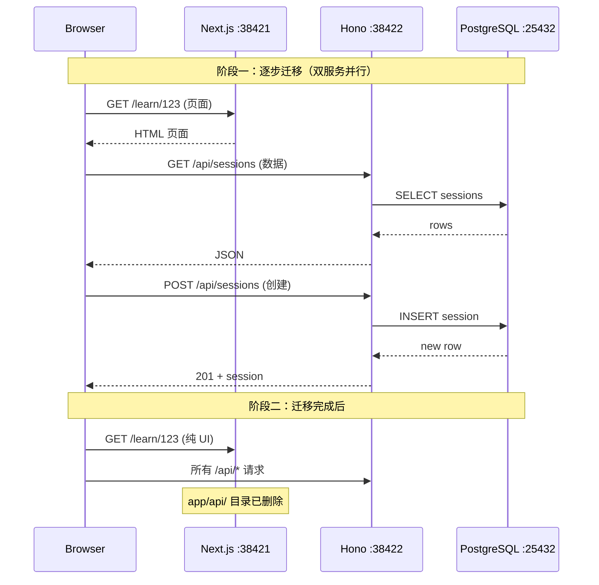

# 016 — 架构拆分 Phase 1：Next.js → Hono API 迁移

> 状态：✅ 已完成 | 分类：🟠 优化 | 优先级：P0 | 依赖：015

**目标**：将 API Routes 从 Next.js 迁移到 Hono，Next.js 变为纯前端

#### 时序图



#### 伪代码

```typescript
// apps/server/src/index.ts — Hono 入口
import { Hono } from "hono"
import { serve } from "@hono/node-server"
import { cors } from "hono/cors"
import { logger } from "hono/logger"
import { sessionsRoute } from "./routes/sessions"
import { diagnosticRoute } from "./routes/diagnostic"
import { suggestedTopicsRoute } from "./routes/suggested-topics"
import { suggestReplyRoute } from "./routes/suggest-reply"
import { quickQuestionRoute } from "./routes/quick-question"
import { errorHandler } from "./middleware/error-handler"

export const app = new Hono()

// 全局中间件
app.use("*", cors({ origin: "http://localhost:38421", credentials: true }))
app.use("*", logger())
app.onError(errorHandler)

// 挂载路由
app.route("/api/sessions", sessionsRoute)
app.route("/api/sessions/:sessionId/diagnostic", diagnosticRoute)
app.route("/api/suggested-topics", suggestedTopicsRoute)
app.route("/api/suggest-reply", suggestReplyRoute)
app.route("/api/quick-question", quickQuestionRoute)

// 启动
serve({ fetch: app.fetch, port: 38422 }, (info) => {
  console.log(`Hono API listening on http://localhost:${info.port}`)
})

// apps/server/src/routes/sessions.ts — 路由示例
import { Hono } from "hono"
import { zValidator } from "@hono/zod-validator"
import { prisma } from "@ai-teacher/db"
import { createSessionSchema } from "@ai-teacher/shared"

export const sessionsRoute = new Hono()
  .get("/", async (c) => {
    const userId = c.req.header("x-user-id") // 临时，后续走 auth middleware
    const sessions = await prisma.session.findMany({
      where: { userId }, orderBy: { updatedAt: "desc" },
    })
    return c.json(sessions)
  })
  .post("/", zValidator("json", createSessionSchema), async (c) => {
    const data = c.req.valid("json")
    const session = await prisma.session.create({ data })
    return c.json(session, 201)
  })
```

#### 文件清单

| 操作 | 文件路径 | 说明 |
|------|---------|------|
| 新增 | `apps/server/package.json` | Hono 项目配置，依赖 hono + @hono/node-server + @hono/zod-validator |
| 新增 | `apps/server/tsconfig.json` | TypeScript 配置，引用 shared/db workspaces |
| 新增 | `apps/server/src/index.ts` | Hono 入口，serve 监听 38422 |
| 新增 | `apps/server/src/config.ts` | 环境变量读取（DATABASE_URL, PORT 等） |
| 新增 | `apps/server/src/routes/sessions.ts` | 会话 CRUD 路由 |
| 新增 | `apps/server/src/routes/diagnostic.ts` | 诊断路由（生成 + 评估） |
| 新增 | `apps/server/src/routes/suggested-topics.ts` | 推荐话题路由 |
| 新增 | `apps/server/src/routes/suggest-reply.ts` | AI 建议回复路由（SSE） |
| 新增 | `apps/server/src/routes/quick-question.ts` | 快问路由（SSE） |
| 新增 | `apps/server/src/middleware/error-handler.ts` | 全局错误处理 |
| 新增 | `apps/server/src/middleware/auth.ts` | 认证中间件（预留） |
| 修改 | `apps/web/src/lib/api-client.ts` | API base URL 改为 `http://localhost:38422` |
| 修改 | `pnpm-workspace.yaml` | 新增 `apps/server` |
| 修改 | `package.json` | 新增 `dev:server` 脚本，更新 `dev` 为 run-p |
| 删除 | `apps/web/src/app/api/**/*.ts` | Next.js API Routes 全部删除 |

#### Checklist

- [x] 创建 `apps/server/` 目录，初始化 Hono 项目（hono + @hono/node-server）
- [x] 迁移 `/api/sessions` 路由（POST 创建 + GET 列表）
- [x] 迁移 `/api/sessions/[id]` 路由（GET + PATCH + DELETE）
- [x] 迁移 `/api/sessions/[id]/diagnostic` 路由（POST 生成 + POST 评估）
- [x] 迁移 `/api/suggested-topics` 路由（GET）
- [x] 迁移 `/api/suggest-reply` 路由（POST）
- [x] 迁移 `/api/quick-question` 路由（POST + SSE）
- [x] Hono 添加 CORS middleware（允许 Next.js :38421 跨域）
- [x] Hono 添加错误处理 middleware
- [x] Next.js 删除 `app/api/` 目录下所有 route.ts
- [x] 前端通过 Next.js rewrite proxy 调用 Hono API（避免 CORS）
- [x] 更新 `pnpm dev` 脚本（run-p dev:web dev:server）
- [x] 文档更新：开发日志

#### 验证标准

| 验证项 | 通过条件 |
|--------|---------|
| E2E 全量测试 | `npx playwright test` 全部通过 |
| Hono 独立启动 | `pnpm --filter @ai-teacher/server dev` 启动无报错 |
| CORS 跨域 | Next.js :38421 页面可正常调用 Hono :38422 API |
| SSE 流式 | quick-question 和 suggest-reply 的 SSE 流正常返回 |
| Next.js 无 API | `apps/web/src/app/api/` 目录不存在 |
| 会话完整流程 | 创建会话 → 进入学习 → 诊断 → 对话 → 结束，全部正常 |

---

## E2E 覆盖

| E2E 分类 | 测试文件 | 关键用例 ID | 备注 |
|---------|---------|------------|------|
| 全量回归 | `e2e/*.spec.ts` | 全部 | 迁移后所有 E2E 必须通过 |

### 迁移期间需要关注的测试

| 原有测试 | 可能影响 | 注意事项 |
|---------|---------|---------|
| `e2e/home.spec.ts` | API base URL 变更 | 前端 api-client 切换到 Hono |
| `e2e/chat.spec.ts` | SSE 端点变更 | 流式端点从 Next.js API Route 迁移到 Hono |
| `e2e/learn.spec.ts` | 数据加载路径变更 | Session/Roadmap 数据获取路径变化 |
| `e2e/diagnostic.spec.ts` | 诊断 API 迁移 | POST/GET 诊断端点迁移 |
| `e2e/session-management.spec.ts` | Session CRUD 迁移 | 所有 Session API 迁移 |
| `e2e/mastery.spec.ts` | 掌握度 API 迁移 | 节点推进 API 迁移 |
| `e2e/quick-features.spec.ts` | 快问/建议回复 API 迁移 | SSE 端点迁移 |
