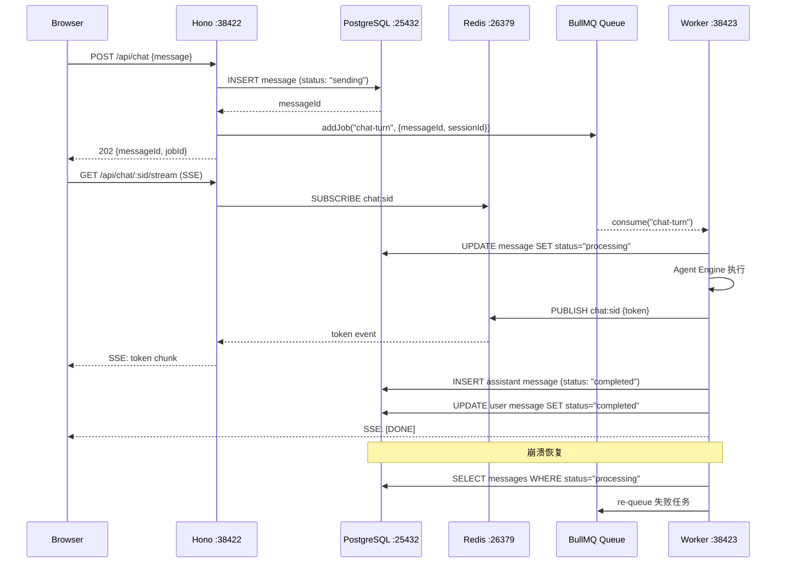

# 017 — 架构拆分 Phase 2：Worker 激活 + BullMQ 队列

> 状态：✅ 已完成 | 分类：🟠 优化 | 优先级：P0 | 依赖：016

**目标**：激活 Worker 为独立进程，引入 BullMQ 消息队列

#### 时序图



#### 伪代码

```typescript
// apps/worker/src/processors/chat-turn.ts — 对话队列消费
import { Queue, Worker as BullWorker } from "bullmq"
import { Redis } from "ioredis"
import { prisma } from "@ai-teacher/db"
import { runAgent } from "../engine/agent-loop"

const redis = new Redis(process.env.REDIS_URL!)
const chatQueue = new Queue("chat-turn", { connection: redis })
const publisher = new Redis(process.env.REDIS_URL!) // 专用 publish 连接

// 消费 chat-turn 队列
export const chatTurnWorker = new BullWorker(
  "chat-turn",
  async (job) => {
    const { messageId, sessionId, userId } = job.data

    // 标记 processing
    await prisma.message.update({
      where: { id: messageId },
      data: { status: "processing" },
    })

    // 执行 Agent，流式输出通过 Redis Pub/Sub 推送
    const stream = await runAgent({ sessionId, userId })
    let fullContent = ""

    for await (const chunk of stream) {
      if (chunk.type === "text-delta") {
        fullContent += chunk.textDelta
        await publisher.publish(
          `chat:${sessionId}`,
          JSON.stringify({ type: "token", content: chunk.textDelta })
        )
      }
    }

    // 持久化 assistant 消息
    await prisma.message.create({
      data: {
        sessionId,
        role: "assistant",
        content: fullContent,
        status: "completed",
      },
    })

    // 标记用户消息完成
    await prisma.message.update({
      where: { id: messageId },
      data: { status: "completed" },
    })

    // 推送完成信号
    await publisher.publish(
      `chat:${sessionId}`,
      JSON.stringify({ type: "done" })
    )
  },
  {
    connection: redis,
    concurrency: 10,
    limiter: { max: 10, duration: 1000 },
  }
)

// apps/server/src/routes/chat.ts — Hono SSE 代理
import { Hono } from "hono"
import { streamSSE } from "hono/streaming"
import { Redis } from "ioredis"

export const chatRoute = new Hono()
  .post("/", async (c) => {
    const { sessionId, content } = await c.req.json()
    // 写 DB + 入队
    const message = await prisma.message.create({
      data: { sessionId, role: "user", content, status: "sending" },
    })
    await chatQueue.add("chat-turn", {
      messageId: message.id, sessionId, userId: "temp"
    })
    return c.json({ messageId: message.id }, 202)
  })
  .get("/:sessionId/stream", async (c) => {
    const { sessionId } = c.req.param()
    const subscriber = new Redis(process.env.REDIS_URL!)
    await subscriber.subscribe(`chat:${sessionId}`)
    return streamSSE(c, async (stream) => {
      subscriber.on("message", (_ch, data) => {
        const event = JSON.parse(data)
        if (event.type === "done") { stream.close(); return }
        stream.writeSSE({ data: event.content })
      })
    })
  })

// apps/worker/src/index.ts — 崩溃恢复
async function recoverOrphanedJobs() {
  const orphans = await prisma.message.findMany({
    where: { status: "processing" },
  })
  for (const msg of orphans) {
    await chatQueue.add("chat-turn", {
      messageId: msg.id, sessionId: msg.sessionId, userId: msg.userId
    }, { attempts: 2 })
    console.log(`Recovered orphan message: ${msg.id}`)
  }
}
```

#### 文件清单

| 操作 | 文件路径 | 说明 |
|------|---------|------|
| 修改 | `apps/worker/package.json` | 新增 bullmq + ioredis 依赖 |
| 修改 | `apps/worker/src/index.ts` | 从死壳变为队列消费启动入口 + 崩溃恢复 |
| 新增 | `apps/worker/src/processors/chat-turn.ts` | chat-turn 队列消费处理器 |
| 新增 | `apps/worker/src/processors/background.ts` | 后台任务处理器（预留） |
| 新增 | `apps/worker/src/processors/after-chat.ts` | 对话后处理（画像更新等） |
| 新增 | `apps/server/src/routes/chat.ts` | POST 发消息 + SSE 流订阅 |
| 新增 | `apps/server/src/services/queue.ts` | BullMQ Queue 实例封装 |
| 新增 | `apps/server/src/services/sse-proxy.ts` | Redis Pub/Sub → SSE 代理 |
| 修改 | `apps/web/src/lib/api-client.ts` | chat 调用改为 POST + SSE 双请求模式 |
| 修改 | `apps/web/src/hooks/use-chat-stream.ts` | 新增 SSE 流式接收 hook（替代 useChat 直连） |
| 修改 | `package.json` | 新增 `dev:worker` 脚本，更新 `dev` 为三进程并行 |
| 修改 | `docker-compose.yml` | 确保 Redis 端口 26379 配置正确 |

#### Checklist

- [ ] Worker 安装 BullMQ + ioredis
- [ ] Worker 实现 HTTP 端点 `/chat`（接收 SSE 流式对话请求）
- [ ] Hono API 代理 `/api/chat` → Worker `/chat`（透传 SSE stream）
- [ ] 实现 BullMQ chat-turn 队列（Worker 消费）
- [ ] 实现消息状态机：sending → processing → completed / failed
- [ ] 用户消息先写 DB（status: "sending"）再投队列
- [ ] Worker 消费后标记 processing，执行 Agent，完成后标记 completed
- [ ] 实现 Redis Pub/Sub 推送流式 token
- [ ] Hono 新增 `GET /api/chat/:sessionId/stream`（SSE 订阅 Redis Pub/Sub）
- [ ] 前端改为先 POST 发消息 → 拿到 jobId → SSE 订阅流式输出
- [ ] 实现 Worker 崩溃恢复（启动时检查 processing 状态的消息）
- [ ] 清理：删除 Worker 中的死代码（standalone tool 文件）
- [ ] 文档更新：技术架构.md（通信模式）、决策记录.md

#### 验证标准

| 验证项 | 通过条件 |
|--------|---------|
| 单轮对话 | 用户发消息 → Agent 回复 → 页面显示完整 |
| 多用户并发 | 两个浏览器 tab 同时对话，互不阻塞 |
| Worker 独立进程 | `pnpm --filter @ai-teacher/worker dev` 启动无报错 |
| 消息持久化 | 发消息后刷新页面，消息不丢失 |
| 崩溃恢复 | 手动 kill Worker → 重启 → processing 消息自动重入队列 |
| 队列监控 | `redis-cli LLEN bull:chat-turn:waiting` 可查看积压 |
| SSE 断线重连 | 网络短暂中断后重连，不丢消息 |
| E2E 全量 | `npx playwright test` 全部通过 |

---

## E2E 覆盖

| E2E 分类 | 测试文件 | 关键用例 ID | 备注 |
|---------|---------|------------|------|
| 全量回归 | `e2e/*.spec.ts` | 全部 | Worker 激活后所有 E2E 必须通过 |

### 需要新增的测试

| 测试文件 | 测试内容 | 关键验证点 |
|---------|---------|-----------|
| `e2e/message-status.spec.ts` | 消息状态生命周期 | sending → processing → completed 状态转换正确，刷新后消息不丢失 |
| `e2e/sse-reconnect.spec.ts` | SSE 断线重连 | 网络短暂中断后重连，不丢 token，流式输出完整 |
| `e2e/queue-monitoring.spec.ts` | 队列监控与崩溃恢复 | 手动 kill Worker 后重启，processing 消息自动重入队列并完成 |
