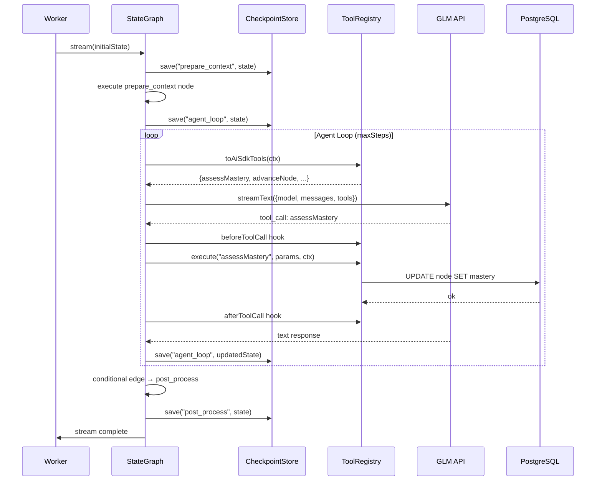

# 018 — Agent 引擎重构 Phase 3：StateGraph + Tool Registry

> 状态：✅ 已完成 | 分类：🟠 优化 | 优先级：P0 | 依赖：017

**目标**：实现轻量 StateGraph 引擎 + Tool Registry DI 系统

#### 时序图



#### 伪代码

```typescript
// packages/agent/src/state-graph.ts — 核心引擎
interface GraphNode<S> {
  name: string
  execute: (state: S, ctx: ExecutionContext) => Promise<S>
}

interface ConditionalEdge<S> {
  from: string
  condition: (state: S) => string
}

interface StreamEvent {
  type: "node_complete" | "tool_call" | "tool_result" | "text_delta" | "error"
  node?: string
  data?: unknown
}

export class StateGraph<S> {
  private nodes = new Map<string, GraphNode<S>>()
  private edges: Map<string, string | ConditionalEdge<S>> = new Map()
  private entryPoint = ""

  setEntryPoint(name: string): this {
    this.entryPoint = name
    return this
  }
  addNode(name: string, execute: GraphNode<S>["execute"]): this {
    this.nodes.set(name, { name, execute })
    return this
  }
  addEdge(from: string, to: string): this {
    this.edges.set(from, to)
    return this
  }
  addConditionalEdge(from: string, condition: (s: S) => string): this {
    this.edges.set(from, { from, condition })
    return this
  }

  async *stream(initialState: S, ctx: ExecutionContext): AsyncGenerator<StreamEvent> {
    let current = this.entryPoint
    let state = initialState
    while (current !== "__end__") {
      const node = this.nodes.get(current)
      if (!node) throw new Error(`Unknown node: ${current}`)
      await ctx.checkpoint.save(current, state)
      state = await node.execute(state, ctx)
      const edge = this.edges.get(current)
      current = typeof edge === "string" ? edge
        : edge ? edge.condition(state) : "__end__"
      yield { type: "node_complete", node: current, data: state }
    }
  }
}

// packages/agent/src/tool-registry.ts — 工具注册 + DI
interface ToolDefinition {
  name: string
  description: string
  parameters: z.ZodSchema
  execute: (params: unknown, ctx: ToolExecutionContext) => Promise<ToolResult>
  promptSnippet?: string
  promptGuidelines?: string[]
}

export class ToolRegistry {
  private tools = new Map<string, ToolDefinition>()
  private hooks: ToolHooks = {}

  register(tool: ToolDefinition): void { this.tools.set(tool.name, tool) }
  setHooks(hooks: ToolHooks): void { this.hooks = hooks }

  async execute(name: string, params: unknown, ctx: ToolExecutionContext): Promise<ToolResult> {
    const tool = this.tools.get(name)
    if (!tool) throw new Error(`Tool not found: ${name}`)
    if (this.hooks.beforeToolCall) {
      const decision = await this.hooks.beforeToolCall(name, params, ctx)
      if (decision.skip) return decision.result
    }
    const result = await tool.execute(params, ctx)
    if (this.hooks.afterToolCall) {
      await this.hooks.afterToolCall(name, params, result, ctx)
    }
    return result
  }

  toPromptSection(): string {
    return Array.from(this.tools.values())
      .filter((t) => t.promptSnippet)
      .map((t) => t.promptSnippet)
      .join("\n\n")
  }

  toAiSdkTools(ctx: ToolExecutionContext): Record<string, CoreTool> {
    const result: Record<string, CoreTool> = {}
    for (const [name, def] of this.tools) {
      result[name] = tool({
        description: def.description,
        parameters: def.parameters,
        execute: (params) => def.execute(params, ctx),
      })
    }
    return result
  }
}

// apps/worker/src/graphs/tutor-graph.ts — 教学工作流定义
const tutorGraph = new StateGraph<TutorState>()
  .setEntryPoint("prepare_context")
  .addNode("prepare_context", async (state, ctx) => {
    const context = await ctx.contextManager.load(state.sessionId)
    return { ...state, messages: context.messages }
  })
  .addNode("agent_loop", async (state, ctx) => {
    const tools = ctx.toolRegistry.toAiSdkTools(ctx.toolContext)
    const result = await streamText({
      model: ctx.model,
      system: buildSystemPrompt(ctx),
      messages: state.messages,
      tools,
      maxSteps: 10,
    })
    return { ...state, streamResult: result }
  })
  .addNode("post_process", async (state, ctx) => {
    await ctx.queue.add("after-chat", {
      sessionId: state.sessionId,
      messages: state.newMessages,
    })
    return state
  })
  .addEdge("prepare_context", "agent_loop")
  .addConditionalEdge("agent_loop", (state) =>
    state.needsFollowUp ? "prepare_context" : "post_process"
  )
  .addEdge("post_process", "__end__")
```

#### 文件清单

| 操作 | 文件路径 | 说明 |
|------|---------|------|
| 新增 | `packages/agent/package.json` | 共享 Agent 引擎包 |
| 新增 | `packages/agent/tsconfig.json` | TS 配置 |
| 新增 | `packages/agent/src/index.ts` | 包入口，导出 StateGraph / ToolRegistry / CheckpointStore |
| 新增 | `packages/agent/src/state-graph.ts` | StateGraph 核心实现 |
| 新增 | `packages/agent/src/tool-registry.ts` | ToolRegistry + DI + hooks |
| 新增 | `packages/agent/src/checkpoint.ts` | CheckpointStore 接口 + Prisma 实现 |
| 新增 | `packages/agent/src/types.ts` | TutorState, ExecutionContext, ToolResult 等类型 |
| 新增 | `packages/agent/src/events.ts` | AgentEvent 遥测事件定义 |
| 修改 | `apps/worker/src/tools/assess-mastery.ts` | 重构为 ToolDefinition 格式 |
| 修改 | `apps/worker/src/tools/advance-node.ts` | 重构为 ToolDefinition 格式 |
| 修改 | `apps/worker/src/tools/record-strength.ts` | 重构为 ToolDefinition 格式（合并原 recordMisconception） |
| 修改 | `apps/worker/src/tools/generate-assessment.ts` | 重构为 ToolDefinition 格式 |
| 修改 | `apps/worker/src/tools/get-context.ts` | 新增 ToolDefinition |
| 新增 | `apps/worker/src/graphs/tutor-graph.ts` | TutorAgent StateGraph 定义 |
| 修改 | `apps/worker/src/agents/tutor.ts` | 改用 StateGraph 执行 |
| 修改 | `apps/worker/src/engine/agent-loop.ts` | 接入 ToolRegistry |
| 修改 | `pnpm-workspace.yaml` | 新增 `packages/agent` |

#### Checklist

- [x] 创建 `packages/agent/` 共享包（Worker 依赖）
- [x] 实现 `StateGraph` 类（节点注册 + 条件边 + 执行循环）
- [x] 实现 `CheckpointStore` 接口（Prisma 实现，每步自动保存状态）
- [x] 实现 `ToolRegistry` 类（register + toAiSdkTools + toPromptSection）
- [x] 重构 5 个工具为独立 ToolDefinition（带 promptSnippet + promptGuidelines）
- [x] 工具 execute 接收 `ToolExecutionContext`（prisma, sessionId, userId）
- [x] 实现 beforeToolCall / afterToolCall 钩子
- [x] TutorAgent 改用 StateGraph 定义流程（prepare_context → agent_loop → post_process）
- [x] RoadmapAgent / DiagnosticAgent 保持 BaseAgent（不需要 StateGraph）
- [x] 实现 AgentEvent 遥测（AgentEventEmitter）
- [x] 文档更新：技术架构.md（Agent 架构）

#### 验证标准

| 验证项 | 通过条件 |
|--------|---------|
| StateGraph 执行 | prepare_context → agent_loop → post_process 节点按序执行 |
| Checkpoint 保存 | 每个节点执行前 DB 中有 checkpoint 记录 |
| Checkpoint 恢复 | 从指定 checkpoint 重启后，从断点继续执行 |
| ToolRegistry DI | 工具通过 ToolExecutionContext 获取 prisma，不直接 import |
| beforeToolCall hook | 钩子可以拦截工具调用（如 skip 返回） |
| afterToolCall hook | 钩子在工具执行后触发日志/副作用 |
| toPromptSection | 收集所有工具的 promptSnippet 注入 system prompt |
| E2E 全量 | `npx playwright test` 全部通过 |
| 对话功能 | 完整教学对话流程（讲解 → 提问 → 评估 → 推进）正常 |

---

## E2E 覆盖

| E2E 分类 | 测试文件 | 关键用例 ID | 备注 |
|---------|---------|------------|------|
| 全量回归 | `e2e/*.spec.ts` | 全部 | 引擎重构后所有 E2E 必须通过 |

### 需要新增的测试

| 测试文件 | 测试内容 | 关键验证点 |
|---------|---------|-----------|
| `e2e/checkpoint.spec.ts` | Checkpoint 保存与恢复 | 每个节点执行前 DB 中有 checkpoint 记录；从指定 checkpoint 重启后从断点继续执行 |
| `e2e/tool-hooks.spec.ts` | Tool 执行钩子 | beforeToolCall 钩子可拦截工具调用（skip 返回）；afterToolCall 钩子在工具执行后触发日志/副作用 |
