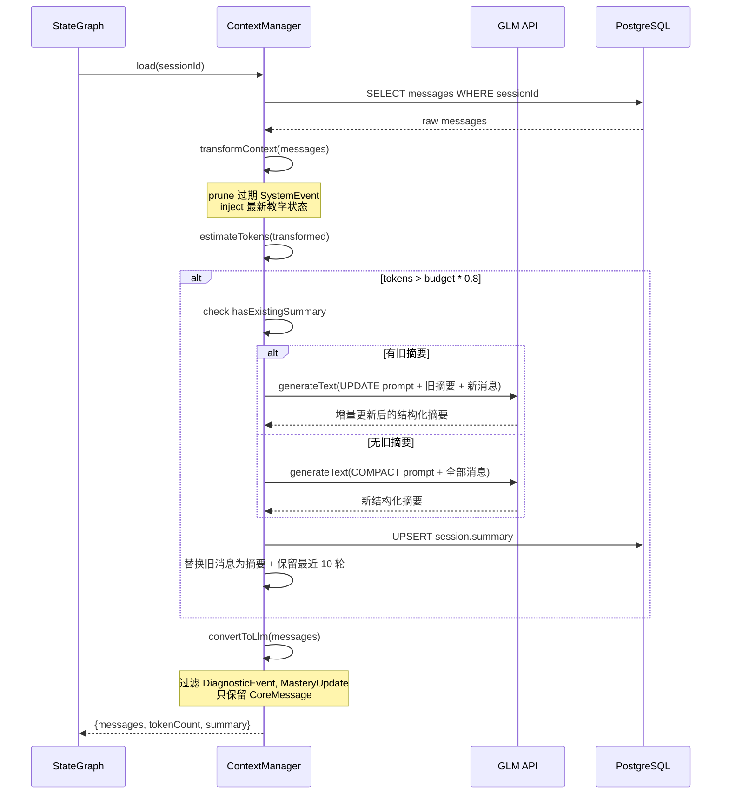

# 019 — 上下文管理升级：Compaction + AgentMessage 分层

> 状态：✅ 已完成 | 分类：🟠 优化 | 优先级：P1 | 依赖：018

**目标**：实现结构化上下文压缩和教学消息分层

#### 时序图



#### 伪代码

```typescript
// apps/worker/src/engine/context-manager.ts

// AgentMessage 分层：内部消息格式（不直接发给 LLM）
type AgentMessage =
  | { type: "llm"; role: "user" | "assistant"; content: string }
  | { type: "diagnostic"; event: "question" | "answer"; data: DiagnosticData }
  | { type: "mastery"; nodeId: string; score: number; action: "assessed" | "advanced" }
  | { type: "system"; event: "compact" | "error" | "checkpoint"; detail: string }

interface StructuredSummary {
  completedTopics: string[]
  masteryState: Record<string, { level: string; lastAssessed: string }>
  misconceptions: string[]
  learningPreferences: {
    preferredExplanationStyle: string
    pacePreference: "fast" | "moderate" | "slow"
  }
  keyDecisions: string[]
}

export class ContextManager {
  private tokenBudget: number // 如 8000 for glm-4-flash
  private keepRecentTurns = 10

  async load(sessionId: string): Promise<ContextResult> {
    const messages = await this.loadMessages(sessionId)
    const transformed = this.transformContext(messages)
    const tokenCount = this.estimateTokens(transformed)
    if (tokenCount > this.tokenBudget * 0.8) {
      return this.compact(sessionId, transformed)
    }
    const llmMessages = this.convertToLlm(transformed)
    return { messages: llmMessages, tokenCount, summary: null }
  }

  transformContext(messages: AgentMessage[]): AgentMessage[] {
    // 剪枝：移除过期 SystemEvent（> 50 轮前的）
    // 注入：在头部插入最新教学状态摘要（掌握度、当前节点）
    const pruned = messages.filter((m) => {
      if (m.type === "system" && m.event === "checkpoint") return false
      return true
    })
    return pruned
  }

  convertToLlm(messages: AgentMessage[]): CoreMessage[] {
    // 过滤非 LLM 消息，只保留 type === "llm" 的消息
    // 转换为 AI SDK CoreMessage 格式
    return messages
      .filter((m) => m.type === "llm")
      .map((m) => ({ role: m.role, content: m.content }))
  }

  async compact(sessionId: string, messages: AgentMessage[]): Promise<ContextResult> {
    const existingSummary = await this.loadSummary(sessionId)
    const recent = messages.slice(-this.keepRecentTurns * 2) // 保留最近 10 轮（20 条）
    const toCompress = messages.slice(0, -this.keepRecentTurns * 2)

    const prompt = existingSummary
      ? this.buildUpdatePrompt(existingSummary, toCompress)
      : this.buildCompactPrompt(toCompress)

    const { text } = await generateText({
      model: this.model,
      prompt,
      schema: StructuredSummarySchema, // Zod schema 约束输出
    })
    const newSummary: StructuredSummary = JSON.parse(text)

    await this.saveSummary(sessionId, newSummary)
    const compacted = [
      { type: "llm", role: "assistant", content: this.formatSummary(newSummary) },
      ...recent,
    ] as AgentMessage[]
    return {
      messages: this.convertToLlm(compacted),
      tokenCount: this.estimateTokens(compacted),
      summary: newSummary,
    }
  }

  private estimateTokens(messages: AgentMessage[]): number {
    // 精确估算：tiktoken 或基于字符数的保守估算（中文 1 字 ≈ 2 token）
    return messages.reduce((sum, m) => {
      if (m.type === "llm") {
        return sum + Math.ceil(m.content.length * 1.5)
      }
      return sum + 20 // 非文本消息估算 20 token
    }, 0)
  }
}
```

#### 文件清单

| 操作 | 文件路径 | 说明 |
|------|---------|------|
| 新增 | `apps/worker/src/engine/context-manager.ts` | ContextManager 主实现 |
| 新增 | `apps/worker/src/engine/agent-message.ts` | AgentMessage union type 定义 + 类型守卫 |
| 新增 | `apps/worker/src/engine/compaction.ts` | 结构化摘要生成 + 增量更新逻辑 |
| 新增 | `apps/worker/src/engine/token-estimator.ts` | Token 估算工具 |
| 新增 | `packages/shared/src/schemas/summary.ts` | StructuredSummary Zod schema |
| 修改 | `apps/worker/src/graphs/tutor-graph.ts` | prepare_context 节点接入 ContextManager |
| 修改 | `packages/db/prisma/schema.prisma` | Session model 新增 summary Json 字段 |
| 修改 | `packages/agent/src/types.ts` | 新增 AgentMessage 相关类型 |
| 修改 | `apps/worker/src/engine/agent-loop.ts` | 消息转换为 AgentMessage 分层格式 |

#### Checklist

- [x] 定义 `AgentMessage` union type（LLM Message + DiagnosticEvent + MasteryUpdate + SystemEvent）
- [x] 实现 `transformContext()`（prune/inject 教学状态消息）
- [x] 实现 `convertToLlm()`（过滤非 LLM 消息，转换为 CoreMessage[]）
- [x] 实现精确 Token 估算（基于 tiktoken 或 API reported usage）
- [x] 实现 Compaction 触发条件（contextTokens > contextWindow - reserveTokens）
- [x] 实现结构化摘要生成（completedTopics + masteryState + misconceptions + keyDecisions）
- [x] 实现增量摘要更新（有上次摘要时用 UPDATE prompt 合并）
- [x] 实现 `shouldStopAfterTurn` 检查
- [x] TutorAgent 集成两阶段转换（transformContext → convertToLlm）
- [x] 文档更新：技术架构.md（上下文管理章节）

#### 验证标准

| 验证项 | 通过条件 |
|--------|---------|
| 长对话稳定 | 50+ 轮对话不崩溃，token 不超限 |
| 压缩触发 | 上下文超过预算 80% 时自动触发 Compaction |
| 摘要质量 | 压缩后生成结构化摘要，包含 completedTopics + masteryState |
| 增量更新 | 第二次压缩时，摘要在旧摘要基础上增量更新 |
| 教学状态保留 | 压缩后掌握度、当前节点等关键信息不丢失 |
| 非文本过滤 | DiagnosticEvent / MasteryUpdate 不发送给 LLM |
| AgentMessage 转换 | 所有消息正确分类为 AgentMessage 四种类型 |
| E2E 全量 | `npx playwright test` 全部通过 |

---

## E2E 覆盖

### 需要新增的测试

| 测试文件 | 测试内容 | 关键验证点 |
|---------|---------|-----------|
| `e2e/long-conversation.spec.ts` | 长对话稳定性 | 50+ 轮对话不崩溃，token 不超限，每轮回复内容完整 |
| `e2e/compaction-trigger.spec.ts` | Compaction 触发机制 | 上下文超过预算 80% 时自动触发；第二次压缩使用增量更新；压缩后教学状态（掌握度、当前节点）不丢失 |
| `e2e/summary-quality.spec.ts` | 摘要质量验证 | 结构化摘要包含 completedTopics + masteryState；非文本消息（DiagnosticEvent / MasteryUpdate）不发送给 LLM |
