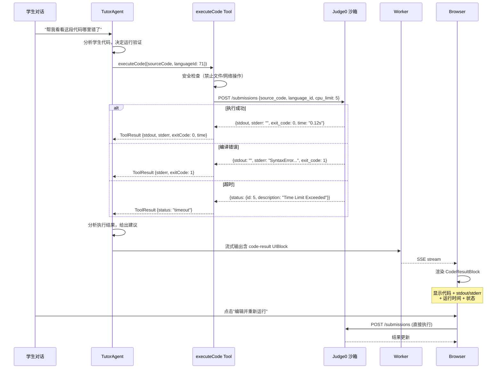

# 021 — 代码执行沙箱

> 状态：⬜ 待开始 | 分类：🔵 功能 | 优先级：P1 | 依赖：020

**目标**：集成 Judge0 沙箱，支持 Agent 工具调用代码执行

**优先级**：P1 | **依赖**：020

#### 时序图



#### 伪代码

```typescript
// apps/worker/src/sandbox/client.ts — Judge0 HTTP 客户端
const JUDGE0_URL = process.env.JUDGE0_URL ?? "http://localhost:2358"

interface Judge0Submission {
  source_code: string
  language_id: number
  stdin?: string
  expected_output?: string
  cpu_time_limit: number   // 秒
  memory_limit: number      // KB
  wall_time_limit: number   // 秒
}

interface Judge0Result {
  stdout: string | null
  stderr: string | null
  exit_code: number
  time: string
  memory: number
  status: { id: number; description: string }
}

export async function submitCode(submission: Judge0Submission): Promise<Judge0Result> {
  // 提交
  const { body: token } = await fetch(`${JUDGE0_URL}/submissions?base64_encoded=false`, {
    method: "POST",
    headers: { "Content-Type": "application/json" },
    body: JSON.stringify({
      ...submission,
      cpu_time_limit: submission.cpu_time_limit ?? 5,
      memory_limit: submission.memory_limit ?? 256000,
      wall_time_limit: submission.wall_time_limit ?? 10,
    }),
  }).then((r) => r.json())

  // 轮询等结果（最多 15 秒）
  const maxAttempts = 30
  for (let i = 0; i < maxAttempts; i++) {
    const result = await fetch(`${JUDGE0_URL}/submissions/${token}`).then((r) => r.json())
    if (result.status.id >= 3) return result // 3+ = 完成（含错误）
    await new Promise((r) => setTimeout(r, 500))
  }
  throw new Error("Judge0 execution timeout")
}

// apps/worker/src/sandbox/languages.ts — 语言 ID 映射
export const LANGUAGE_MAP = {
  python: 71,     // Python 3
  javascript: 63, // JavaScript (Node.js)
  java: 62,       // Java (OpenJDK)
  cpp: 54,        // C++ (GCC 9.2)
  c: 50,          // C (GCC 9.2)
  typescript: 74, // TypeScript
} as const

// apps/worker/src/tools/execute-code.ts — Agent 工具定义
import { z } from "zod"
import { submitCode, LANGUAGE_MAP } from "../sandbox"
import type { ToolDefinition, ToolExecutionContext, ToolResult } from "@ai-teacher/agent"

const DANGEROUS_PATTERNS = [
  /import\s+os/,       // 文件系统
  /import\s+socket/,   // 网络
  /require\("fs"\)/,   // Node.js 文件系统
  /child_process/,     // 子进程
]

export const executeCodeTool: ToolDefinition = {
  name: "executeCode",
  description: "在安全沙箱中执行学生代码，返回运行结果",
  parameters: z.object({
    sourceCode: z.string().describe("要执行的代码"),
    languageId: z.number().describe("Judge0 语言 ID，如 71=Python 3"),
    stdin: z.string().optional().describe("标准输入"),
    expectedOutput: z.string().optional().describe("期望输出，用于自动判定"),
  }),
  execute: async (params, _ctx: ToolExecutionContext): Promise<ToolResult> => {
    // 安全检查
    for (const pattern of DANGEROUS_PATTERNS) {
      if (pattern.test(params.sourceCode)) {
        return {
          success: false,
          error: "代码包含不允许的操作（文件系统/网络/子进程）",
          uiBlock: { type: "code-result", language: "python", code: params.sourceCode, stdout: "", stderr: "安全检查未通过", exitCode: -1 },
        }
      }
    }
    const result = await submitCode({
      source_code: params.sourceCode,
      language_id: params.languageId,
      stdin: params.stdin,
      expected_output: params.expectedOutput,
      cpu_time_limit: 5, memory_limit: 256000, wall_time_limit: 10,
    })
    return {
      success: result.exit_code === 0,
      stdout: result.stdout ?? "",
      stderr: result.stderr ?? "",
      exitCode: result.exit_code,
      time: result.time,
      memory: result.memory,
      status: result.status.description,
      uiBlock: {
        type: "code-result",
        language: Object.entries(LANGUAGE_MAP).find(([, id]) => id === params.languageId)?.[0] ?? "unknown",
        code: params.sourceCode,
        stdout: result.stdout ?? "",
        stderr: result.stderr ?? "",
        exitCode: result.exit_code,
      },
    }
  },
  promptSnippet: "你可以使用 executeCode 工具在安全沙箱中运行学生的代码。支持 Python、JavaScript、Java、C++ 等 60+ 种语言。执行有资源限制：CPU 5 秒、内存 256MB、墙钟 10 秒。",
  promptGuidelines: [
    "运行代码前先检查是否有明显的安全问题（如文件系统操作、网络请求）",
    "如果代码执行失败，分析错误信息并给出修改建议",
    "对比运行结果和期望输出时，注意空白字符和换行的差异",
  ],
}
```

#### 文件清单

| 操作 | 文件路径 | 说明 |
|------|---------|------|
| 修改 | `docker-compose.yml` | 新增 Judge0 服务（judge0-server + judge0-worker + redis-judge0） |
| 新增 | `apps/worker/src/sandbox/client.ts` | Judge0 REST API 封装 + 轮询 |
| 新增 | `apps/worker/src/sandbox/languages.ts` | 语言 ID 映射表 |
| 新增 | `apps/worker/src/tools/execute-code.ts` | executeCode ToolDefinition |
| 新增 | `apps/worker/src/processors/code-exec.ts` | code-exec BullMQ 队列处理器（per-user rate limit） |
| 新增 | `apps/server/src/routes/sandbox.ts` | `POST /api/code-exec` 端点（前端直接执行） |
| 新增 | `apps/web/src/hooks/use-code-exec.ts` | 代码执行 hook（提交 + 轮询结果） |
| 修改 | `apps/web/src/components/ui-blocks/code-result-block.tsx` | 支持"编辑并重新运行"按钮 |
| 修改 | `apps/worker/src/engine/agent-loop.ts` | 注册 executeCode 工具 |
| 修改 | `.env.example` | 新增 JUDGE0_URL 变量 |

#### Checklist

- [ ] docker-compose.yml 新增 Judge0 服务
- [ ] 实现 `sandbox-client.ts`（Judge0 REST API 封装 + 轮询等结果）
- [ ] 注册 `executeCode` 工具到 ToolRegistry（language, code, stdin → stdout, stderr, exitCode）
- [ ] 实现资源限制（CPU 5s, memory 256MB, wall time 10s）
- [ ] Worker 新增 code-exec BullMQ 队列（per-user rate limiting）
- [ ] Hono 新增 `POST /api/code-exec` 端点（前端直接执行）
- [ ] 前端 CodeEditor 新增"运行"按钮 + useCodeExec hook
- [ ] CodeResultBlock 支持编辑后重新执行
- [ ] Tutor prompt 新增 executeCode 使用指引
- [ ] 文档更新：技术架构.md（沙箱章节）、API接口.md

#### 验证标准

| 验证项 | 通过条件 |
|--------|---------|
| Judge0 启动 | `docker compose up judge0` 启动无报错 |
| Python 执行 | 提交 `print("hello")` → stdout = "hello" |
| 编译错误 | 提交语法错误代码 → stderr 包含错误信息 |
| 超时处理 | 提交死循环 → 10 秒后返回 Time Limit Exceeded |
| 安全检查 | 包含 `import os` 的代码被拒绝 |
| Agent 工具调用 | 对话中 Agent 主动调用 executeCode 并分析结果 |
| 前端渲染 | CodeResultBlock 显示代码 + 输出 + 运行时间 + 状态标签 |
| 重新执行 | 点击"重新运行"按钮 → 修改代码 → 结果更新 |
| 速率限制 | 同一用户 10 秒内最多 5 次执行 |
| E2E 全量 | `npx playwright test` 全部通过 |

## E2E 覆盖

| E2E 分类 | 测试文件 | 关键用例 ID | 备注 |
|---------|---------|------------|------|
| 代码执行 | `e2e/chat.spec.ts` | 新增用例 | 沙箱提交 + 结果渲染 |
| 安全检查 | `e2e/chat.spec.ts` | 新增用例 | 危险代码被拦截 |

### 需要新增的测试

| 测试场景 | 优先级 | 说明 |
|---------|--------|------|
| 代码执行 — Python 成功 | P0 | 提交 `print("hello")` 返回正确 stdout |
| 代码执行 — 编译错误 | P0 | 语法错误代码返回 stderr 信息 |
| 代码执行 — 超时 | P1 | 死循环代码返回 Time Limit Exceeded |
| 代码执行 — 安全检查 | P0 | 含 `import os` 的代码被拦截 |
| 重新执行按钮 | P1 | 点击按钮修改代码后重新运行，结果更新 |
| 速率限制 | P2 | 同一用户短时间内多次执行被限流 |
