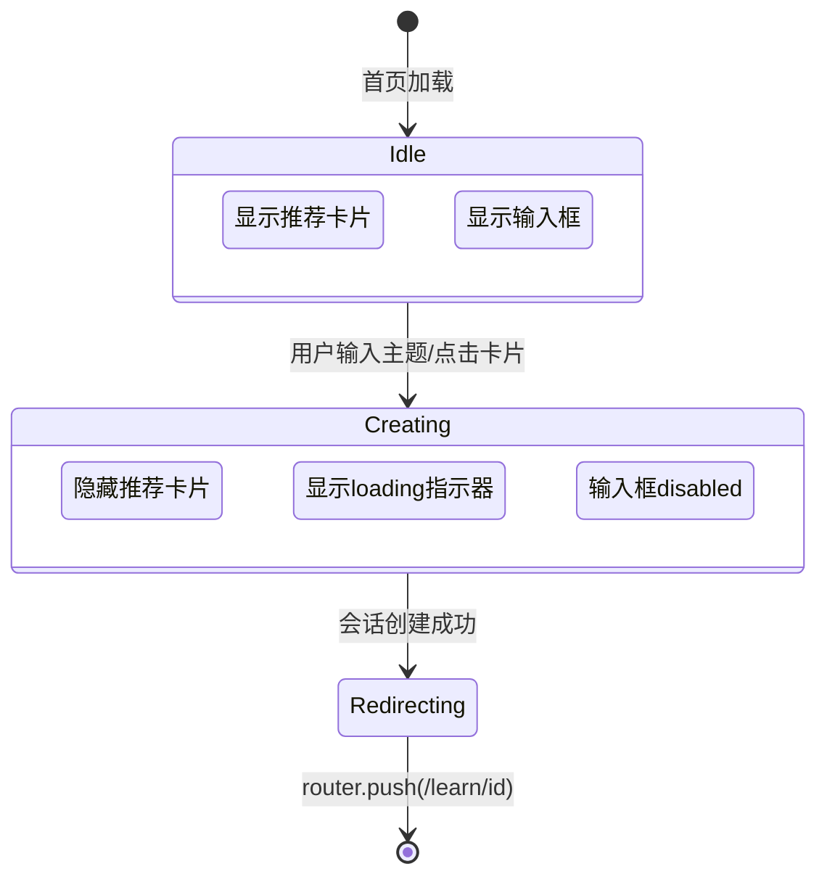
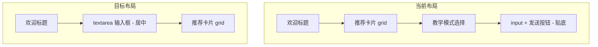

# 迭代 033：首页交互优化

> 优先级：P0 | 依赖：032 | 分类：功能
> 覆盖用户反馈：#1（推荐卡片 loading 时隐藏 + 消息格式）、#2（输入框改 textarea + 上移）

---

## 1. 目标

1. **推荐卡片在发送消息后立即隐藏**：用户输入主题或点击推荐卡片后，进入 loading/创建会话状态时，推荐卡片区域消失，只保留 loading 指示器
2. **推荐卡片点击后发送的第一条消息格式为 `学习xxx`**：而非直接发送主题名（如"情绪管理与压力释放"→"学习情绪管理与压力释放"）
3. **输入框改为 textarea**：参考竞品 UI，输入框改为多行 textarea，位置上移，不贴底部
4. **输入框样式升级**：圆角、placeholder "你想学什么?"、带图标

---

## 2. 技术方案

### 2.1 推荐卡片隐藏逻辑

**实现**：`welcome-content.tsx` 中，当 `creating === true` 时，整个推荐卡片区域（`
或者试试这些
` + grid）不渲染。

### 2.2 消息格式修改

**当前行为**：点击推荐卡片 → `createSession(topic.title)` → 后端创建 session topic="情绪管理与压力释放" → tutor 收到第一条消息为主题名

**目标行为**：点击推荐卡片 → `createSession(topic.title)` → session topic 不变，但发送给 Agent 的第一条用户消息为 `学习${topic}`

**改动点**：
- `apps/server/src/routes/sessions.ts`：创建 session 后自动插入的第一条 user message 内容从 `topic` 改为 `学习${topic}`
- 或 `apps/server/src/routes/chat.ts`：如果是通过 chat 路由发送的，确保消息格式

需要确认：第一条消息的注入点在哪里。检查 session 创建流程和 chat 发送流程。

### 2.3 输入框改 textarea

**当前**：`welcome-content.tsx` 用 `<input type="text">`，固定在 form 底部

**目标**：改为 `<textarea>`，参考竞品：
- 圆角 12px
- min-height 48px，可自动扩展
- placeholder: "你想学什么?"
- 左侧有灯泡图标
- 右侧有发送按钮
- 位置居中，不贴底部（当前已是 `justify-center`，但 form 在内容下方，需确保视觉居中）

**布局调整**：输入框移到推荐卡片**上方**，先输入框后卡片，视觉上更突出。教学模式选择器移到 textarea 内部左下角（参考竞品布局）。

---

## 3. 文件清单

| 文件 | 改动内容 |
|------|---------|
| `apps/web/src/app/welcome-content.tsx` | 1. `creating=true` 时隐藏推荐卡片 2. input→textarea 3. 布局调整：textarea 上移 4. 卡片点击消息格式 `学习xxx` |
| `apps/server/src/routes/sessions.ts` | 确认/修改第一条 user message 格式为 `学习${topic}` |
| `apps/server/src/routes/chat.ts` | 同上，确认消息注入点 |
| `e2e/home.spec.ts` | 更新测试：推荐卡片 loading 隐藏 + 新消息格式 |

---

## 4. 验证标准

- [ ] 输入主题后回车 → 推荐卡片立即消失，显示 loading → 跳转到学习页
- [ ] 点击推荐卡片 → 推荐卡片立即消失，显示 loading → 跳转到学习页
- [ ] 跳转后第一条用户消息为"学习xxx"格式
- [ ] 输入框为 textarea，可多行输入
- [ ] 输入框 placeholder 为 "你想学什么?"
- [ ] 输入框视觉居中，不贴底部
- [ ] `pnpm build` 通过
- [ ] E2E 测试通过

---

## 5. Checklist

- [ ] `welcome-content.tsx` creating 状态隐藏推荐卡片
- [ ] `welcome-content.tsx` 卡片点击 → `createSession("学习" + topic.title)`
- [ ] `welcome-content.tsx` input → textarea（自动扩展高度）
- [ ] `welcome-content.tsx` 布局调整（textarea 上移，卡片下移）
- [ ] 后端确认第一条 user message 格式
- [ ] `e2e/home.spec.ts` 更新
- [ ] build 通过
- [ ] E2E 通过
