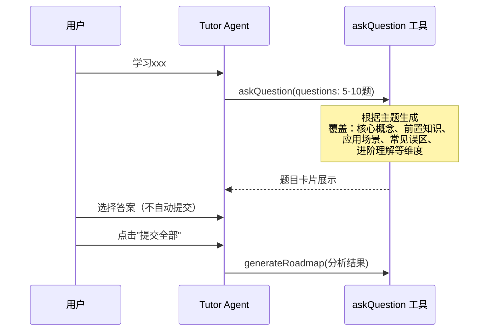
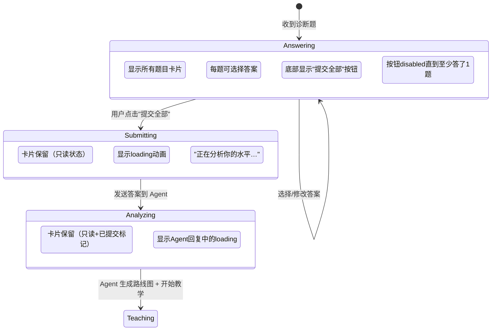

# 迭代 034：诊断摸底增强

> 优先级：P0 | 依赖：033 | 分类：功能
> 覆盖用户反馈：#3（摸底题目增加到 10 道以内）、#6（手动提交 + loading + 保留已答卡片）

---

## 1. 目标

1. **增加摸底题目数量**：从固定 2 题 → 根据学习主题动态生成 5-10 题，覆盖更多维度
2. **手动提交**：选完选项后不自动提交，等用户主动点击"提交"按钮
3. **提交后 loading**：点击提交后显示 loading 状态（分析中…），而非只显示"已提交"
4. **保留已答卡片**：提交后不清除诊断卡片，保留在聊天历史中让用户可以回顾

---

## 2. 技术方案

### 2.1 增加摸底题目数量

**改动**：
- `apps/worker/src/agent/tools/ask-question.ts`：
  - `questions` 数组的 maxItems 从当前值增加到 10
  - `promptSnippet` 修改：从"生成 2 个诊断选择题"→"根据学习主题生成 5-10 个诊断选择题"
  - 新增维度指引：核心定义、前置知识、实际应用、常见误区、进阶概念

- `apps/worker/src/agent/prompts/tutor.ts`：
  - 诊断阶段指令从"出 2 个诊断选择题"→"出 5-10 个诊断选择题，涵盖多个维度"

### 2.2 手动提交机制

**当前行为分析**：需要查看前端如何处理 `askQuestion` 工具的响应和用户答案提交。关键组件：
- `apps/web/src/components/chat/` 下处理 tool invocation 的组件
- `apps/web/src/hooks/use-chat-stream.ts` 中 askQuestion 的处理

**改动**：
- 诊断题卡片组件：选择答案后不自动发送消息，而是记录在本地 state
- 新增"提交全部"按钮：在所有题目下方，点击后将所有答案一次性发送
- 提交后：卡片变为只读状态 + 显示"正在分析…" loading
- 卡片永久保留在消息历史中

### 2.3 提交后 loading 状态

**loading 展示**：
- 提交按钮变为 spinner + "正在分析你的水平…"
- 或在卡片下方显示分析进度动画
- Agent 回复到达后 loading 消失

### 2.4 保留已答卡片

**当前行为**：需确认诊断卡片是否在提交后被清除
**目标**：已答题目作为历史消息的一部分，永久保留在聊天区，标记为"已提交"状态

---

## 3. 文件清单

| 文件 | 改动内容 |
|------|---------|
| `apps/worker/src/agent/tools/ask-question.ts` | questions maxItems→10，promptSnippet 改为 5-10 题 + 多维度 |
| `apps/worker/src/agent/prompts/tutor.ts` | 诊断阶段指令更新：5-10 题 |
| 前端诊断卡片组件（需确认路径） | 手动提交机制 + loading + 只读状态 |
| `apps/web/src/hooks/use-chat-stream.ts` | 确认 askQuestion 响应处理 |
| `e2e/diagnostic.spec.ts` | 更新测试：题目数量 + 手动提交流程 |

---

## 4. 验证标准

- [ ] 新会话创建后，Agent 生成 5-10 道诊断题（非固定 2 道）
- [ ] 选择答案后不会自动提交
- [ ] 点击"提交全部"按钮后才发送答案
- [ ] 提交后显示 loading 动画（"正在分析…"）
- [ ] 分析完成后 loading 消失，开始教学
- [ ] 已提交的诊断卡片保留在聊天历史中
- [ ] 卡片变为只读状态，标记"已提交"
- [ ] `pnpm build` 通过
- [ ] E2E 测试通过

---

## 5. Checklist

- [ ] `ask-question.ts` questions maxItems 增加到 10
- [ ] `ask-question.ts` promptSnippet 更新为 5-10 题 + 多维度指引
- [ ] `tutor.ts` prompt 诊断指令更新
- [ ] 前端诊断卡片：移除自动提交逻辑
- [ ] 前端诊断卡片：新增"提交全部"按钮
- [ ] 前端诊断卡片：提交后 loading 状态
- [ ] 前端诊断卡片：提交后只读 + "已提交"标记
- [ ] 前端诊断卡片：保留在消息历史
- [ ] `e2e/diagnostic.spec.ts` 更新
- [ ] build 通过
- [ ] E2E 通过
