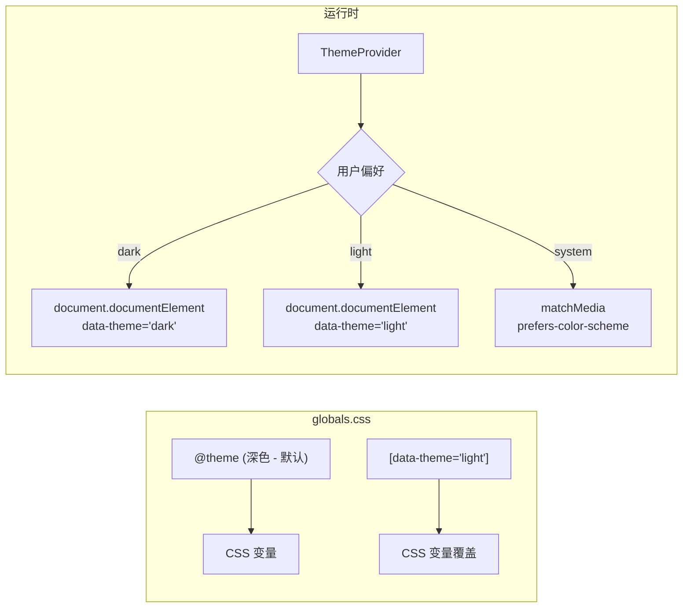
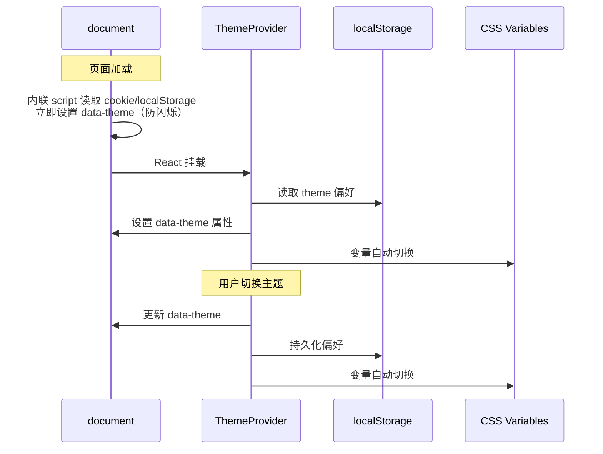

# 迭代 036：浅色主题 + 皮肤切换

> 优先级：P0 | 依赖：032 | 分类：功能
> 覆盖用户反馈：#5（浅色护眼主题 + 主题切换功能）

---

## 1. 目标

1. 新增浅色护眼主题（参考竞品：白色背景 + 浅灰文字 + 橙色强调）
2. 实现主题切换功能（深色/浅色/跟随系统）
3. 主题偏好持久化（localStorage + cookie 防闪烁）

---

## 2. 技术方案

### 2.1 CSS 变量双主题体系



**CSS 架构**：

当前 `globals.css` 的所有 CSS 变量定义在 `@theme` 块中，作为深色主题默认值。新增浅色主题通过 `[data-theme="light"]` 选择器覆盖同名变量。

```css
/* 深色主题 - 当前默认 */
@theme {
  --color-background: #0f1117;
  --color-foreground: #e8eaed;
  /* ... 70+ 变量 */
}

/* 浅色主题 - 新增 */
[data-theme="light"] {
  --color-background: #fafafa;
  --color-foreground: #1a1a1a;
  --color-primary: #6366f1;
  /* ... 覆盖所有颜色变量 */
}
```

### 2.2 浅色主题配色方案

参考竞品截图 + 护眼研究，浅色主题采用：

| 区域 | 颜色 | 说明 |
|------|------|------|
| 背景 | `#fafafa` / `#ffffff` | 主背景 / 卡片背景 |
| 文字 | `#1a1a1a` / `#6b7280` | 主文字 / 次要文字 |
| 主色 | `#6366f1`（靛蓝） | 保持与深色一致 |
| 强调 | `#f59e0b`（琥珀橙） | 交互高亮 |
| 边框 | `#e5e7eb` | 浅灰边框 |
| 侧栏 | `#f5f5f5` | 略深于主背景 |
| 代码块 | `#f3f4f6` | 浅灰代码背景 |

### 2.3 ThemeProvider 实现



**实现文件**：

1. **`apps/web/src/components/theme-provider.tsx`**（新建）
   - React Context：`ThemeContext` 提供 `theme` + `setTheme`
   - 支持三种模式：`dark` | `light` | `system`
   - `useEffect` 监听 `prefers-color-scheme` 变化
   - 切换时设置 `document.documentElement.dataset.theme`

2. **`apps/web/src/app/layout.tsx`**
   - `<html>` 标签添加内联 script 防闪烁
   - 包裹 `<ThemeProvider>`

3. **`apps/web/src/components/theme-toggle.tsx`**（新建）
   - 三态切换按钮：☀️ / 🌙 / 💻
   - 放在左侧栏 header 或右上角

### 2.4 防闪烁方案

在 `<head>` 中注入内联 script，在 React hydration 之前读取 localStorage 并设置 `data-theme`：

```html
<script>
  (function() {
    var theme = localStorage.getItem('theme') || 'dark';
    if (theme === 'system') {
      theme = window.matchMedia('(prefers-color-scheme: light)').matches ? 'light' : 'dark';
    }
    document.documentElement.dataset.theme = theme;
  })();
</script>
```

---

## 3. 文件清单

| 文件 | 改动内容 |
|------|---------|
| `apps/web/src/app/globals.css` | 新增 `[data-theme="light"]` 块，覆盖所有颜色变量 |
| `apps/web/src/components/theme-provider.tsx` | **新建** — ThemeContext + Provider |
| `apps/web/src/components/theme-toggle.tsx` | **新建** — 主题切换按钮组件 |
| `apps/web/src/app/layout.tsx` | 包裹 ThemeProvider + 防闪烁 script |
| `apps/web/src/components/layout/left-sidebar.tsx` | header 区域添加 ThemeToggle |
| `e2e/home.spec.ts` | 新增主题切换测试 |

---

## 4. 验证标准

- [ ] 深色主题保持当前效果不变
- [ ] 浅色主题：所有页面元素可读、对比度符合 WCAG AA
- [ ] 切换主题：所有 CSS 变量正确覆盖，无残留深色/浅色元素
- [ ] 跟随系统：macOS 切换外观后自动跟随
- [ ] 刷新页面不闪烁（防闪烁 script 生效）
- [ ] 主题偏好持久化（关闭浏览器重新打开保持选择）
- [ ] `pnpm build` 通过
- [ ] E2E 测试通过

---

## 5. Checklist

- [ ] `globals.css` 新增完整浅色主题变量
- [ ] `theme-provider.tsx` 实现 ThemeContext
- [ ] `theme-toggle.tsx` 实现切换按钮
- [ ] `layout.tsx` 集成 ThemeProvider + 防闪烁
- [ ] `left-sidebar.tsx` 添加 ThemeToggle
- [ ] 验证所有组件在浅色主题下的渲染效果
- [ ] `e2e/home.spec.ts` 主题切换测试
- [ ] build 通过
- [ ] E2E 通过
