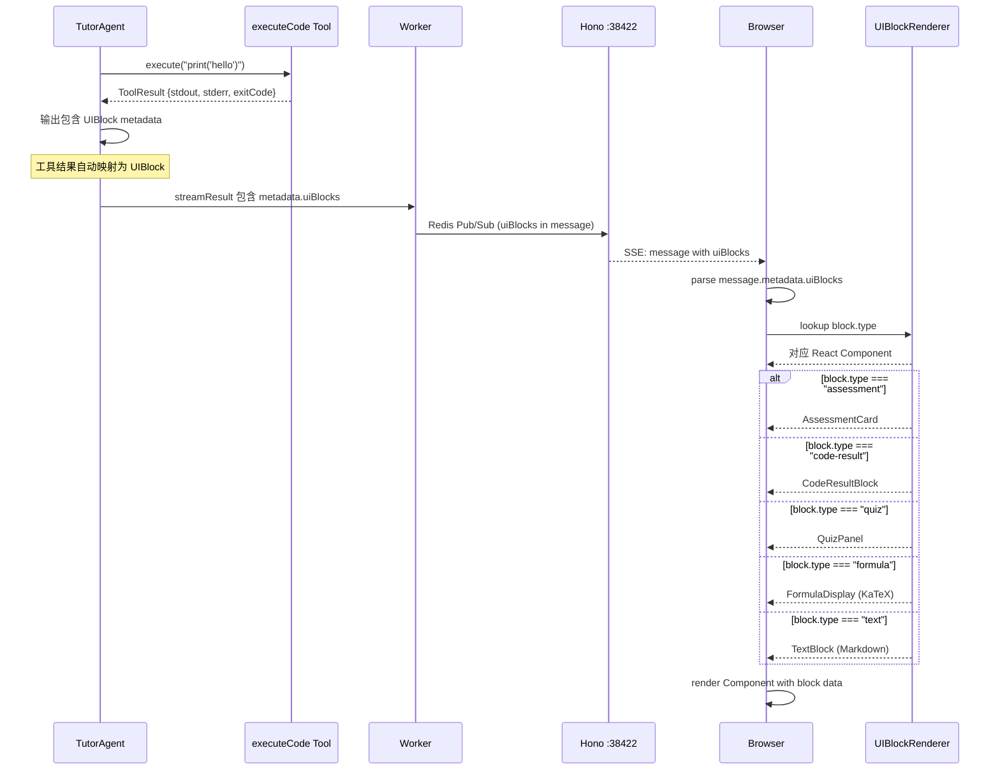

# 020 — A2UI 框架 + 代码编辑器

> 状态：⬜ 待开始 | 分类：🔵 功能 | 优先级：P1 | 依赖：018

**目标**：实现 AI-to-UI 组件渲染框架 + CodeMirror 嵌入式编辑器

**优先级**：P1 | **依赖**：020

#### 时序图



#### 伪代码

```typescript
// packages/shared/src/schemas/ui-block.ts — UIBlock Schema (Zod 4)
import { z } from "zod"

export const UIBlockSchema = z.discriminatedUnion("type", [
  z.object({
    type: z.literal("text"),
    content: z.string(),
  }),
  z.object({
    type: z.literal("assessment"),
    question: z.string(),
    options: z.array(z.string()),
    correctIndex: z.number(),
    explanation: z.string(),
    nodeId: z.string().optional(),
  }),
  z.object({
    type: z.literal("quiz"),
    questions: z.array(z.object({
      question: z.string(),
      options: z.array(z.string()),
      correctIndex: z.number(),
    })),
  }),
  z.object({
    type: z.literal("code-result"),
    language: z.string(),
    code: z.string(),
    stdout: z.string(),
    stderr: z.string(),
    exitCode: z.number(),
  }),
  z.object({
    type: z.literal("formula"),
    latex: z.string(),
    description: z.string(),
  }),
  z.object({
    type: z.literal("diagram"),
    diagramType: z.enum(["flowchart", "mindmap", "sequence"]),
    data: z.unknown(),
  }),
])

export type UIBlock = z.infer<typeof UIBlockSchema>

// apps/web/src/components/ui-blocks/registry.tsx — Component Registry
import { TextBlock } from "./text-block"
import { AssessmentCard } from "./assessment-card"
import { QuizPanel } from "./quiz-panel"
import { CodeResultBlock } from "./code-result-block"
import { FormulaDisplay } from "./formula-display"
import { DiagramRenderer } from "./diagram-renderer"

export const UIBlockRenderer: Record<UIBlock["type"], React.FC<{ block: UIBlock }>> = {
  text: TextBlock,
  assessment: AssessmentCard,
  quiz: QuizPanel,
  "code-result": CodeResultBlock,
  formula: FormulaDisplay,
  diagram: DiagramRenderer,
}

// apps/web/src/components/ui-blocks/index.tsx — 渲染入口
export function MessageContent({ message }: { message: ChatMessage }) {
  const blocks = message.metadata?.uiBlocks ?? [
    { type: "text" as const, content: message.content },
  ]
  return (
    <div className="space-y-3">
      {blocks.map((block, i) => {
        const Component = UIBlockRenderer[block.type]
        return <Component key={i} block={block} />
      })}
    </div>
  )
}

// apps/web/src/components/editor/code-editor.tsx — CodeMirror 嵌入式编辑器
import { EditorView, basicSetup } from "codemirror"
import { EditorState } from "@codemirror/state"
import { python } from "@codemirror/lang-python"
import { javascript } from "@codemirror/lang-javascript"
import { oneDark } from "@codemirror/theme-one-dark"

const LANGUAGE_MAP = {
  python: python(),
  javascript: javascript(),
}

export function CodeEditor({
  language, value, onChange, readOnly, compact,
}: CodeEditorProps) {
  const editorRef = useRef<HTMLDivElement>(null)
  const viewRef = useRef<EditorView>()

  useEffect(() => {
    if (!editorRef.current) return
    const langExt = LANGUAGE_MAP[language] ?? []
    const state = EditorState.create({
      doc: value,
      extensions: [
        basicSetup,
        langExt,
        warmTheme, // 自定义暖色主题，匹配设计系统
        EditorView.editable.of(!readOnly),
        compact ? EditorView.theme({ "&": { maxHeight: "200px" } }) : [],
        EditorView.updateListener.of((update) => {
          if (update.docChanged && onChange) {
            onChange(update.state.doc.toString())
          }
        }),
      ],
    })
    viewRef.current = new EditorView({ state, parent: editorRef.current })
    return () => viewRef.current?.destroy()
  }, [language])

  return <div ref={editorRef} className="cm-compact" />
}
```

#### 文件清单

| 操作 | 文件路径 | 说明 |
|------|---------|------|
| 新增 | `packages/shared/src/schemas/ui-block.ts` | UIBlock Zod discriminated union schema |
| 新增 | `apps/web/src/components/ui-blocks/registry.tsx` | type → Component 映射表 |
| 新增 | `apps/web/src/components/ui-blocks/index.tsx` | MessageContent 渲染入口 |
| 新增 | `apps/web/src/components/ui-blocks/text-block.tsx` | 文本/Markdown 渲染 |
| 新增 | `apps/web/src/components/ui-blocks/assessment-card.tsx` | 评估卡片（重构自现有） |
| 新增 | `apps/web/src/components/ui-blocks/quiz-panel.tsx` | 交互测验面板 |
| 新增 | `apps/web/src/components/ui-blocks/code-result-block.tsx` | 代码运行结果展示 |
| 新增 | `apps/web/src/components/ui-blocks/formula-display.tsx` | KaTeX 公式渲染 |
| 新增 | `apps/web/src/components/ui-blocks/diagram-renderer.tsx` | 图表渲染（预留） |
| 新增 | `apps/web/src/components/editor/code-editor.tsx` | CodeMirror 6 编辑器组件 |
| 新增 | `apps/web/src/components/editor/warm-theme.ts` | 暖色自定义主题 |
| 新增 | `apps/web/src/components/editor/language-map.ts` | 语言 ID → CodeMirror 语言包映射 |
| 修改 | `apps/web/package.json` | 新增 @codemirror/* + katex 依赖 |
| 修改 | `apps/web/src/components/chat/message-bubble.tsx` | 集成 MessageContent 替换纯文本渲染 |
| 修改 | `packages/shared/src/index.ts` | 导出 UIBlockSchema |

#### Checklist

- [ ] 定义 `UIBlock` Zod discriminated union schema（shared 包）
- [ ] 实现 `UIBlockRenderer` 前端组件（type → Component 映射）
- [ ] 重构 AssessmentCard 为 UIBlock 渲染
- [ ] 新增 InteractiveQuiz UIBlock 组件（可点击选项 + 即时反馈）
- [ ] 新增 FormulaBlock UIBlock 组件（KaTeX LaTeX 渲染）
- [ ] 安装 CodeMirror 6 依赖（@codemirror/view, @codemirror/state, @codemirror/lang-python, @codemirror/lang-javascript）
- [ ] 实现 `CodeEditor` 组件（语言切换 + 语法高亮 + 紧凑模式）
- [ ] 实现 `CodeResultBlock` UIBlock 组件（只读代码 + 输出面板）
- [ ] CodeEditor 自定义暖色主题（匹配设计系统）
- [ ] Tool 输出自动映射到 UIBlock 格式
- [ ] Message metadata.uiBlocks 数组写入和读取
- [ ] 文档更新：技术架构.md（A2UI 章节）、API接口.md（UIBlock schema）

#### 验证标准

| 验证项 | 通过条件 |
|--------|---------|
| 文本渲染 | 普通对话消息正常显示 Markdown（标题、列表、代码块） |
| 评估卡片 | 节点掌握后显示评估卡片，样式与现有一致 |
| 交互测验 | QuizPanel 可点击选项，点击后显示正确/错误反馈 |
| 公式渲染 | FormulaBlock 正确渲染 LaTeX 公式（如 $\frac{a}{b}$） |
| 代码编辑器 | CodeEditor 在对话气泡中正常显示，支持 Python/JS 语法高亮 |
| 暖色主题 | 编辑器配色与设计系统协调，不使用冷色调 |
| UIBlock Schema | Zod 解析/校验通过，TypeScript 类型推导正确 |
| 向后兼容 | 不含 uiBlocks 的旧消息降级为 TextBlock 渲染 |
| E2E 全量 | `npx playwright test` 全部通过 |

## E2E 覆盖

| E2E 分类 | 测试文件 | 关键用例 ID | 备注 |
|---------|---------|------------|------|
| UIBlock 渲染 | `e2e/chat.spec.ts` | 新增用例 | 覆盖各类型 UIBlock |
| 代码编辑器 | `e2e/chat.spec.ts` | 新增用例 | CodeMirror 交互 |

### 需要新增的测试

| 测试场景 | 优先级 | 说明 |
|---------|--------|------|
| UIBlock 渲染 — 文本 | P0 | 普通对话消息正常 Markdown 渲染 |
| UIBlock 渲染 — 评估卡片 | P0 | 节点掌握后显示评估卡片 |
| UIBlock 渲染 — 交互测验 | P1 | QuizPanel 可点击选项并反馈 |
| UIBlock 渲染 — 公式 | P1 | LaTeX 公式正确渲染 |
| UIBlock 渲染 — 向后兼容 | P0 | 不含 uiBlocks 的旧消息降级为 TextBlock |
| CodeEditor 组件 | P1 | 对话气泡中 CodeMirror 正常显示 |
