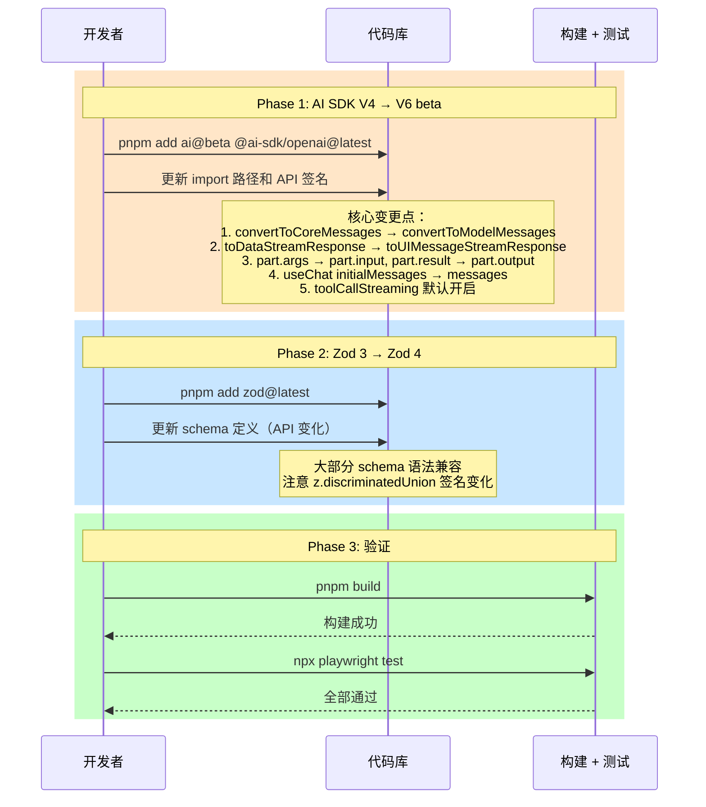

# 023 — 技术栈全面升级

> 状态：⬜ 待开始 | 分类：🟠 优化 | 优先级：P2 | 依赖：017

**目标**：升级 AI SDK V6 beta + Zod 4 + 最新依赖

**优先级**：P2 | **依赖**：017

#### 时序图



#### 伪代码

```typescript
// ===== AI SDK V4 → V6 核心变更对照 =====

// 1. 消息转换函数重命名
// V4:
import { convertToCoreMessages } from "ai"
const coreMessages = convertToCoreMessages(messages)

// V6 beta:
import { convertToModelMessages } from "ai"
const modelMessages = convertToModelMessages(messages)

// 2. 流式响应方法变更
// V4:
const result = await streamText({ model, messages, tools })
return result.toDataStreamResponse()

// V6 beta:
const result = await streamText({ model, messages, tools })
return result.toUIMessageStreamResponse()

// 3. 工具调用参数/结果字段重命名
// V4:
for (const part of result.toolCalls) {
  const args = part.args      // 输入参数
  const result = part.result  // 执行结果
}

// V6 beta:
for (const part of result.toolCalls) {
  const input = part.input    // 输入参数
  const output = part.output  // 执行结果
}

// 4. useChat hook 初始化参数变更
// V4:
const { messages, input, handleSubmit } = useChat({
  initialMessages: savedMessages,
  api: "/api/chat",
})

// V6 beta:
const { messages, input, handleSubmit } = useChat({
  messages: savedMessages,  // 不再叫 initialMessages
  sendAutomaticallyWhen: (message) => {
    // 控制何时自动发送（替代旧的 onToolCall return value）
    return message.toolInvocations?.every((t) => "output" in t)
  },
})

// 5. useChat 消息类型变更
// V4:
import { Message } from "ai"

// V6 beta:
import { UIMessage } from "ai"

// 6. 工具 UI 状态变更（3态 → 4态）
// V4: partial-call / call / result
// V6 beta: input-streaming / input-available / output-available / output-error

// ===== Zod 3 → Zod 4 变更对照 =====

// 大部分 API 兼容，主要变更：
// 1. z.discriminatedUnion 签名微调
// V3:
const schema = z.discriminatedUnion("type", [schemaA, schemaB])

// V4:（语法基本一致，但内部实现更高效）
const schema = z.discriminatedUnion("type", [schemaA, schemaB])

// 2. 性能提升：解析速度提升约 3x
// 3. 更好的类型推导：深层 infer 自动推导

// ===== apps/worker/src/engine/agent-loop.ts 升级示例 =====
import { streamText, convertToModelMessages } from "ai"  // V6
import type { UIMessage } from "ai"                       // V6

export async function runAgent(params: AgentParams) {
  const modelMessages = convertToModelMessages(params.messages) // V6

  const result = await streamText({
    model: params.model,
    system: params.systemPrompt,
    messages: modelMessages,
    tools: params.tools,
    maxSteps: 10,
    onStepFinish: ({ toolCalls }) => {
      // V6: toolCalls 使用 input/output
      for (const tc of toolCalls) {
        emitEvent({ type: "tool_call", name: tc.toolName, input: tc.input })
      }
    },
  })

  return result.toUIMessageStreamResponse() // V6
}

// ===== apps/web/src/hooks/use-chat-stream.ts 升级示例 =====
import { useChat } from "ai/react"        // V6
import type { UIMessage } from "ai"        // V6

export function useChatStream(sessionId: string) {
  return useChat({
    messages: [],  // V6: 初始消息（不再叫 initialMessages）
    api: `${HONO_URL}/api/chat`,
    sendAutomaticallyWhen: (message) => {
      // 当所有工具调用都有输出时自动发送
      return message.toolInvocations?.every(
        (invocation) => "output" in invocation
      ) ?? true
    },
    onFinish: (message: UIMessage) => {
      // V6: UIMessage 类型
      console.log("Stream finished", message.id)
    },
  })
}
```

#### 文件清单

| 操作 | 文件路径 | 说明 |
|------|---------|------|
| 修改 | `apps/worker/package.json` | `ai` → `ai@beta`，`@ai-sdk/openai` → latest |
| 修改 | `apps/web/package.json` | `ai` → `ai@beta`，`@ai-sdk/react` → latest |
| 修改 | `packages/shared/package.json` | `zod` → latest (Zod 4) |
| 修改 | `apps/worker/src/engine/agent-loop.ts` | convertToModelMessages + toUIMessageStreamResponse |
| 修改 | `apps/worker/src/agents/tutor.ts` | 适配 V6 streamText 签名 |
| 修改 | `apps/worker/src/agents/diagnostic.ts` | 适配 V6 API |
| 修改 | `apps/worker/src/agents/roadmap.ts` | 适配 V6 API |
| 修改 | `apps/worker/src/graphs/tutor-graph.ts` | onStepFinish 使用 input/output |
| 修改 | `apps/worker/src/tools/*.ts` | 工具内部不涉及 V6 变更（保持不变） |
| 修改 | `apps/web/src/hooks/use-chat-stream.ts` | useChat V6：messages + sendAutomaticallyWhen |
| 修改 | `apps/web/src/components/chat/message-bubble.tsx` | toolInvocation 状态 4 态适配 |
| 修改 | `apps/web/src/components/chat/*` | Message → UIMessage 类型替换 |
| 修改 | `packages/shared/src/schemas/*.ts` | Zod 4 适配（大部分兼容，检查 discriminatedUnion） |
| 修改 | `apps/server/src/routes/chat.ts` | 响应格式适配 V6 |
| 修改 | `pnpm-lock.yaml` | 锁文件更新 |

#### Checklist

- [ ] 升级 AI SDK v4 → V6 beta（`pnpm add ai@beta @ai-sdk/openai@latest @ai-sdk/react@latest`）
- [ ] 更新 TutorAgent/RoadmapAgent/DiagnosticAgent 适配 V6 API（convertToModelMessages, toUIMessageStreamResponse）
- [ ] 更新前端 useChat hook 适配 V6 协议（messages 替代 initialMessages, UIMessage 类型, sendAutomaticallyWhen）
- [ ] 更新 toolInvocation 状态渲染（3 态 → 4 态：input-streaming/input-available/output-available/output-error）
- [ ] 升级 Zod 3 → Zod 4（`pnpm add zod@latest`，更新所有 schema 文件）
- [ ] 更新 shared 包所有 Zod schema（检查 discriminatedUnion 等 API 变化）
- [ ] 更新 pnpm-lock.yaml
- [ ] 文档更新：技术架构.md（技术栈表格）、README.md（技术栈表格）

#### 验证标准

| 验证项 | 通过条件 |
|--------|---------|
| 安装无冲突 | `pnpm install` 成功，无 peer dependency 警告 |
| 构建成功 | `pnpm build` 零错误 |
| E2E 全量 | `npx playwright test` 全部通过 |
| 对话流式 | 流式对话正常，打字机效果不中断 |
| 工具调用 | assessMastery / advanceNode 等工具调用正常 |
| useChat V6 | 前端 useChat 的 messages/sendAutomaticallyWhen 正常工作 |
| UIMessage 类型 | TypeScript 编译通过，无类型错误 |
| Zod 4 兼容 | 所有 schema 解析正确（UIBlock, Session, Message 等） |
| SSE 流 | Hono SSE 代理正常，V6 流式协议兼容 |

## E2E 覆盖

| E2E 分类 | 测试文件 | 关键用例 ID | 备注 |
|---------|---------|------------|------|
| 全量回归 | `e2e/*.spec.ts` | 所有现有用例 | 升级后全部必须通过 |
| 流式对话 | `e2e/chat.spec.ts` | 现有用例 | V6 流式协议兼容性 |
| 工具调用 | `e2e/learn.spec.ts` | 现有用例 | input/output 字段适配 |
| Zod 解析 | `e2e/chat.spec.ts` | 现有用例 | Schema 兼容性 |

### 需要新增的测试

| 测试场景 | 优先级 | 说明 |
|---------|--------|------|
| 全量回归 — 升级后全通过 | P0 | 所有现有 E2E 用例在升级后必须通过，无例外 |
| 流式对话 — V6 协议 | P0 | 流式消息正常渲染，打字机效果不中断 |
| 工具调用 — input/output | P0 | assessMastery / advanceNode 等工具调用正常（V6 字段名） |
| Zod Schema 解析 — UIBlock | P0 | UIBlock discriminatedUnion 在 Zod 4 下正确解析 |
| Zod Schema 解析 — Session | P1 | Session 相关 schema 在 Zod 4 下正确解析 |
| useChat V6 — messages 初始化 | P1 | useChat 使用 messages 参数（非 initialMessages）正常初始化 |
| toolInvocation 4 态渲染 | P1 | input-streaming / input-available / output-available / output-error 四态正确渲染 |
| SSE 流 — V6 兼容 | P0 | Hono SSE 代理在 V6 toUIMessageStreamResponse 下正常工作 |
